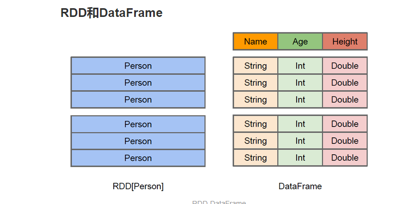
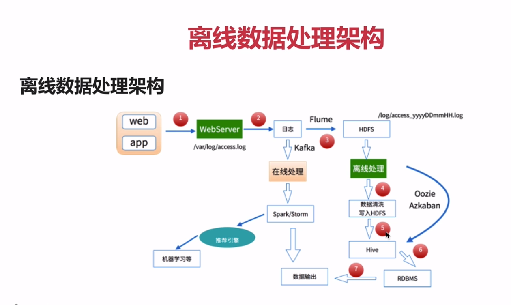

#### Spark
* 阅读Spark SQL相关官方文档笔记,见SparkSQLDoc.md
* Spark Streaming 相关， 见SparkStreaming.md

#### 奇淫巧技
- IDEA，按住ALT，并按住左键进行框选也能实现多行编辑
- Linux的vi编辑。 使用A进入输入模式，再进行复制。如果使用a进入输入模式，复制东西时开头几个字符常常会被删除。

* 分布式的基于内存的列式存储计算框架
* MapReduce局限性
    1. 代码繁琐
    2. 只支持map和reduce方法,
    3. 效率低
    4. 不适合迭代多次/交互式/流式处理
* 框架多样化：会导致学习/运维成本都提高
    1. 批处理（离线）：MapReduce、Hive、Pig
    2. 流式处理（实时）： Storm、JStorm
    3. 交互式计算：Impala
    
* Spark就能完成上面这些所能做的事

#### 注意点
* mvn命令中 -D**的参数是指pom.xml中properties中的参数, -P**的参数是指pom.xml中profile中的参数
* 如果mvn命令提示仓库中已有xxx包,可以使用-U命令
* mvn -X,查看到更详细的错误信息
* jps -m 查看更详细的信息

* 代码中的sparkSession最好取名为spark,因为运行spark-shell后,默认的sparkSession名,即为spark.如果同名,代码可以直接拷贝到spark-shell测试运行
* 当使用linux系统中的path时,需要增加前缀file://, windows则不能添加

* 从数据随机抽取0.1的数据
> spark.read.format("json").option("samplingRatio","0.1").load("/xxx")

* maven打成jar后,提示获取不到资源文件.
    >
        如下写法不可取
        XXX.calss.getResource(path)
        XXX.calss.getClassLoader().getResource(path)
        
        需要这样写
        XXX.class.getResourceAsStream(path)
        XXX.calss.getClassLoader().getResourceAsStream(path)
        
        直接操作流
    >

* Linux的/tmp目录会在重启后清空，zookeeper、kafka有些默认的数据、日志配置在该目录下，通常需要修改
* jps -m命令，可查看每个进程是用哪个文件启动的

#### bug-部分执行时遇到的问题写在了笔记中
* linux中tar命令提示错误,可能是下载时,下载的链接不是最终连接,例如点进去还有一个目录,但你wget了前一个目录.

* 执行spark编译,或者命令行时,莫名出现killed等情况,通常是内存不够

#### 编译
* 自行编译源码 或跳过这一步,直接下载编译好的(主要为了和CDH的hadoop适配,spark的包中需要绑定所使用的hadoop)
    * 在官网选择版本,并选择Source code下载,解压.
    * 查看官网的文档可得,当前版本(2.2.1)需要maven3.3.9以及java8+.
    * 需要配置maven使用内存数的参数(如果使用内置mvn,会自动添加,并且spark在测试编译时,也都会自动添加,所以通常至少要2g内存.)
        > export MAVEN_OPTS="-Xmx2g -XX:ReservedCodeCacheSize=512m"
    * 编译,并自定义scala版本,hadoop版本,yarn版本(如果yarn版本和hadoop版本不同,可用-Dyarn.version指定),hive支持    
        > ./build/mvn -Pyarn  -Phadoop-2.6 -Dhadoop.version=2.6.0-cdh5.13.0  -Phive -Phive-thriftserver  -DskipTests -X clean package
    * 如上编译不能直接使用,可用如下命令编译出可直接使用的包.其本质还是shell脚本调用mvn命令
        > ./dev/make-distribution.sh \
        --name 2.6.0-cdh5.13.0  --tgz \
        -Dscala-2.12.4 -Pyarn  -Phadoop-2.6 -Dhadoop.version=2.6.0-cdh5.13.0 -X  \
        -Phive -Phive-thriftserver  
        * 如上命令其实就--tgz后面跟的还是一样的mvn参数.
        * --name xxx 该参数指定编译后的文件名,在编译完成后,则包名为 spark-2.2.1-bin-xxx.taz
        * 编译cdh版本的hadoop.需要在spark的pom.xml中增加如下仓库
            >
                <repository>
                    <id>cloudera</id>
                    <url>https://repository.cloudera.com/artifactory/cloudera-repos/</url>
                </repository>
            >
        * 有问题,可尝试在pom.xml注释
            >  <!--<useZincServer>true</useZincServer>-->
        * 目前我的编译卡在了内存处,上面的Xmx2g小于2g,各种中断,等于2g,就报内存不足.只得作罢

#### 安装
* 安装scala和maven以及spark
解压,配置环境变量即可.(直接在阿里云服务器上wget scala的解压包..速度比本地翻墙快多了)  
分别运行scala 和 mvn -version测试.

* 可运行spark_home/bin/spark-shell --master local[2] 启动spark.进入命令行界面    
--master指定运行模式,local表示运行模式是本地,其他可选项有yarn/standalone(自带的)等  
[2]表示开启2个线程,[*]表示使用机器上所有线程

* 可进入http://106.14.7.29:4040 查看管理界面

* 运行一个word count
>
    读取文件内容到file变量
    val file = sc.textFile("file:///zx4/Dockerfile")
    将file读取到的文件转为Array[String]
    file.collect
    统计行数
    file.count
    将文件内容按照 空格 分割
    val a = file.flatMap(line => line.split(" "))
    将a转为Array[String]输出
    a.collect
    将a的每个元素附上1
    val b = a.map(word => (word,1))
    输出b
    b.collect
    将所有相同单词两两相加
    val c = b.reduceByKey(_ + _)
    输出c,就得到了单词统计的结果
    c.collect
>
* 上面的真正代码是(运行时不要分行)
>
    sc.textFile("file:///zx4/Dockerfile").flatMap(line => line.split(" ")).map(word => (word,1)).reduceByKey(_ + _).collect
>
        
#### Standalone模式
* 使用spark自带的Standalone模式启动(具体查看官方文档)
    * Spark Standalone模式的架构和Hadoop HDFS/YARN类似
        > 一个Master + n个worker
    * 文件配置
        >
            将conf/spark-env.sh.template 复制为 spark-env.sh
            参考其注释的说明,增加如下参数
                SPARK_MASTER_HOST=hadoop000  #主机名
                SPARK_WORKER_CORES=1  # 允许spark应用使用的机器cpu内核总数,默认全部
                SPARK_WORKER_MEMORY=512m # 分配多少内存
                export JAVA_HOME=/zx/jdk1.8.0_151
            
            如果是分布式配置,还需要拷贝出slaves.template文件为 slaves文件.
            然后将所有worker的hoatname都配置上去,然后在master服务器中启动start-all.sh命令时,就可以自动启动所有worker服务器.
        >
    * 启动集群
        >
             sbin/start-all.sh
             通过查看master的日志可知:
                sparkMaster:7077端口
                MasterUI:8080端口
                REST server:6066端口
                并在Master中注册了一个worker
             查看worker日志可知:
                sparkWorker:33852端口
                WorkerUI:8081端口
                并通过7077端口连接到了master
                
        >
    * 运行spark-shell
        >   
            spark-shell  --total-executor-cores 1   --master spark://hadoop000:7077  --driver-memory 512m --executor-memory 512m
            (很重要)通过sharp-shell --help查看所有参数
            --master指定启动模式为Standalone的话,直接在后面加spark://xxx,表示master节点的url即可.
            --driver-memory指定驱动内存(默认为1g),--executor-memory指定执行器内存(默认为1000m),
                之前就因为这两个参数导致core一直为0,一直为等待状态,无法启动.
            --total-executor-cores(或--executor-cores)配置该应用的核心数.
            例如集群总的核心数为2,默认启用后,使用所有核心数;那么只能启动一个spark-shell,再启动一个的话,第二个获取的核心数为0,状态为waitting,将无法使用
            
            启动后查看8080端口(master的管理界面),可查看到当前所有的运行应用,也就是这个spark-shell
        >
    * 运行上面local模式时测试使用的单词统计.
        >sc.textFile("file:///zx4/Dockerfile").flatMap(line => line.split(" ")).map(word => (word,1)).reduceByKey(_ + _).collect
        
* 任何启动模式都和代码无关,开发时,可直接使用local模式.

#### Spark SQL
* 官网:http://spark.apache.org/sql/
* Shark: Spark推出后,很受欢迎,于是有了Hive on Spark(shark):其目的是为了让Hive基于Spark运行,计算.
    * 缺点: hive ql解析/逻辑执行计划生成/执行计划的优化还是依赖于hive的,只是把物理执行计划从mapReduce替换为了Spark
* Shark终止后,有了两个分支
    * Hive on spark:为了继续支持旧的Shark,Hive社区的
    * Spark SQL:Spark社区的,支持多种数据源,多种优化技术,扩展性也要好很多
    
* SQL on Hadoop的各类框架
    1. Hive 
        >
                sql ==> mapreduce   
                metastore ： 元数据   
                sql：database、table、view  
                facebook提供的开源的  
        >
    2. impala
        >
                cloudera ： cdh（建议大家在生产上使用的hadoop系列版本）、cm(图形化界面操作)  
                sql：自己的守护进程执行的，非mr  
                metastore     
        > 
    3. presto  
        > facebook   京东 sql
    4. drill  
        > sql 访问：hdfs、rdbms、json、hbase、mongodb、s3、hive  
    5. Spark SQL  
        >
                sql  
                dataframe/dataset api  
                metastore  
                访问：hdfs、rdbms、json、hbase、mongodb、s3、hive  ==> 外部数据源
        >  

* Spark SQL概述小结：
    1. Spark SQL的应用并不局限于SQL；
    2. 访问hive、json、parquet等文件的数据；
    3. SQL只是Spark SQL的一个功能而已；
    4. Spark SQL提供了SQL的api、DataFrame和Dataset的API    
* Spark SQL愿景
    1. 写更少的代码
    2. 读更少的数据,例如不读取无关数据等
    3. 无需关注优化   

    
#### IDEA 构建Scala项目
* 使用IDEA创建maven项目,选择骨架为scala-archetype-simple
    >
        只需如下依赖,并修改其版本(可删除其他关于插件/仓库等所有无关信息.)
            <dependency>
              <groupId>org.scala-lang</groupId>
              <artifactId>scala-library</artifactId>
              <version>${scala.version}</version>
            </dependency>
            <dependency>
              <groupId>org.apache.spark</groupId>
              <artifactId>spark-sql_2.11</artifactId>
              <version>${spark-sql.version}</version>
            </dependency>
        还需保留下面的一系列编译插件,最好将其版本改为jvm1.8
        如果下面的运行出错,尝试修改scala.version,不用一定和本地安装的scala环境版本相同.
        我本地环境的scala为2.12.4,使用scala-library版本相同时,报ClassNotFound,更换为2.11.8才可以.
    >
* 或者这样创建
    * 使用idea创建scala - spark项目步骤.(我当前版本的idea/scala构建sbt项目出错,版本不兼容.可能要等更新)
    
    * 右击项目 -> Add Framework Support ,增加maven,然后配置如下
    >
        <properties>
            <maven.test.skip>true</maven.test.skip>
            <spark.version>2.2.1</spark.version>
            <scala.version>2.12.4</scala.version>
        </properties>
    
        <dependencies>
            <dependency>
                <groupId>org.apache.spark</groupId>
                <artifactId>spark-core_2.11</artifactId>
                <version>${spark.version}</version>
            </dependency>
        </dependencies>
    >
    * 注意,创建scala的object,是选择创建scala class的过程中,和选择java接口一样,选择这个类型的.
    * 缺少hadoop的winutils.exe,自行下载放入 
    * 单次统计类
    >
        object WordCount {
          def main(args: Array[String]): Unit ={
            //应用名
            val sparkConf = new SparkConf().setAppName("wordCount")
            val sparkContext = new SparkContext(sparkConf)
        
            val input = sparkContext.textFile("D://a.txt")
        
            val result = input.flatMap(_.split(" "))
              .map((_,1))
              .reduceByKey(_ + _)
            result.saveAsTextFile("D://b")
          }
        }
    >
    
### 从Hive过度到Spark SQL
* SQLContext/HiveContext/SparkContext的使用
    * SQLContext/HiveContext是Spark1.x中的类.已经废弃,只做了解

#### SQLContext(可以在1.6老版本的文档中查看)
* Spark1.x中SparkSQL的入口点:SQLContext
>
    val sc: SparkContext // 一个存在的SparkContext
    val sqlContext = new org.apache.spark.sql.SQLContext(sc)
>
    
* 编写SQLContext的scala类
>
    object SQLContextAPP {
    
      def main(args: Array[String]): Unit = {
        //将运行时传入的第一个参数作为json文件的路径
        val path = args(0)
    
        //1.创建相应的SQLContext,使用过时的方法
        //spark参数配置
        val sparkConf = new SparkConf()
        //在服务器中测试或生产环境,appName和Master是通过脚本指定的.
        //本地运行时,可通过如下代码指定
    //    sparkConf.setAppName("SQLContextAPP").setMaster("local[2]")
        //构建sparkContext
        val sc = new SparkContext(sparkConf)
        //构建SQLContext
        val sqlContext = new SQLContext(sc)
        //2.相关处理:json
        //从传入的路径中读取json文件,val people的类型为DataFrame
        val people = sqlContext.read.format("json").load(path)
        //输出这个json解析的模式,类似于表结构
        people.printSchema()
        //输出json数据,类似于表数据
        people.show()
        //3.关闭资源
        sc.stop()
      }
    }
>
* 本地测试
    * edit run配置,传入参数为json文件的路径
    > C:\Users\97038\Desktop\people.json
    * 必须设置运行模式: A master URL must be set in your configuration. 在执行的命令后携带VM参数-Dspark.master=local   
        也可以在sparkConf类中增加 sparkConf.setAppName("SQLContextAPP").setMaster("local[2]")
* 服务器上测试: 编译后上传jar到服务器,集群运行
    * 提交Spark Application到环境中运行,命令如下
        >
            ./bin/spark-submit \
              --name <appName> \
              --class <main-class> \
              --master <master-url> \
              --deploy-mode <deploy-mode> \
              --conf <key>=<value> \
              ... # other options
              <application-jar> \  # 要提交的jar的位置
              [application-arguments] # 要传递的参数
              
            我们可以据此.设置自己的命令
            ./bin/spark-submit \
                --name SQLContextAPP \
                --class com.zx.spark.SQLContextAPP \
                --master local[2] \
                /zx/spark-2.2.1-bin-hadoop2.7/spark-sql-1.0.jar \
                /zx/spark-2.2.1-bin-hadoop2.7/examples/src/main/resources/people.json 
            
            工作中通常使用shell运行,将其拷贝到一个xxx.shell中,
            然后使用 chmod u+x xxx.shell 给与其执行权限,运行即可
        >

#### HiveContext的使用
* spark1.x中SparkSQL的入口点:HIveContext
    >
        //sc is an existing sparkContext
        val hiveContext = new org.apache.spark.sql.hive.HiveContext(sc)
    >
* 使用hiveContext并不需要有一个安装好的hive环境,只需要一个hive-site.xml即可

* 代码
    * 在之前的项目中增加依赖
        >
                <dependency>
                  <groupId>org.apache.spark</groupId>
                  <artifactId>spark-hive_2.11</artifactId>
                  <version>${spark.version}</version>
                </dependency>
        >
    * HiveContextApp类
        >
            //1.创建相应的HiveContextApp,使用过时的方法
            //spark参数配置
            val sparkConf = new SparkConf()
            //在服务器中测试或生产环境,appName和Master是通过脚本指定的.
            //本地运行时,可通过如下代码指定
            //    sparkConf.setAppName("HiveContextApp").setMaster("local[2]")
            //构建sparkContext
            val sc = new SparkContext(sparkConf)
            //构建HiveContext
            val hiveContext = new HiveContext(sc)
            //2.相关处理:
            //显示相关表
            hiveContext.table("user").show()
            //3.关闭资源
            sc.stop()
        >
* 服务器上测试: 同上
    * 运行
        >
            ./bin/spark-submit \
                --name HiveContextAPP \
                --class com.zx.spark.HiveContextApp \
                --master local[2] \
                --jars /zx/hive/lib/mysql-connector-java-5.1.36.jar \
                /zx/spark-2.2.1-bin-hadoop2.7/spark-sql-1.0.jar 
                
            需要指定hive元数据存储数据库的驱动,此处是mysql的驱动的路径(--jars /zx/hive/lib/mysql-connector-java-5.1.36.jar)
            需要将hive-site.xml拷贝到spark_home/conf/目录下,否则,即使在hive中创建了表,在spark执行时,也无法找到该表  
        >

#### SparkSession的使用
* Spark2.x中Spark SQL的入口点
    >
        val spark = SparkSession
            .builder()
            .appName("SparkSessionApp")
            .config("spark.some.config.option","some-value")
            .getOrCreate()
    >
* 代码
    >
         //将运行时传入的第一个参数作为json文件的路径
            val path = args(0)
            //1. 创建
            val sparkSession = SparkSession.builder()
              .master("local[2]")
              .appName("SparkSessionApp")
              .getOrCreate()
            //2.读取json
            val people = sparkSession.read.json(path)
            //显示json
            people.show()
            //关闭
            sparkSession.stop()
    >    
* 直接在本地测试运行即可.
* 如果遇到NotSuchMethodExption的bug,尝试降低本地Scala和maven中导入的scala依赖的版本为2.11.x;  
    注意,修改本地环境scala版本后,需要在Project Structure -> modules -> dependencies 中修改导入的SDK版本
    
#### Spark-shell/spark-sql脚本的使用
* 需要把hive-site.xml拷贝到spark_home/conf/目录下
* 并在使用命令时使用--jars指定mysql驱动包(该参数可以传多个,用逗号分割)

* Spark-shell: 执行如下命令,启动spark-shell界面
    > spark-shell --master local[2] --jars /zx/hive/lib/mysql-connector-java-5.1.36.jar
    * 在命令行中
        >
            显示所有表
            spark.sql("show tables").show
            查看emp表所有记录
            spark.sql("select * from emp").show
        >
    * 运行时,会有如下error(虽然该error不影响结果)
        > 
            ERROR ObjectStore: Version information found in metastore differs 2.3.0 from expected schema version 1.2.0. Schema verififcation is disabled hive.metastore.schema.verification so setting version.
            在spark/conf/hive-site.xml中添加如下即可
        >

* Spark-sql: 执行如下命令,启动spark-sql界面-和在hive命令行界面一样,直接使用hql操作
    > spark-sql --master local[2] --jars /zx/hive/lib/mysql-connector-java-5.1.36.jar
    * 运行,查询语句,查询
    > select * from emp
    * 可在4040端口查看界面,能看到执行的命令
    * 执行
    >
        创建一张表
        create table t (key string, value string);
        查看查询语句的执行计划(此处无法查看逻辑执行计划,只有物理执行计划)
        explain select a.key*(2+3),b.value from t a join t b on a.key = b.key and a.key >3; 
        查看详细的语句执行计划
        explain extended  select a.key*(2+3),b.value from t a join t b on a.key = b.key and a.key >3; 
        
        分为如下几步:
            1. Parsed Logical Plan:逻辑执行计划
            2. Analyzed Logical Plan:再解析逻辑执行计划,需要和metastore(hive存储在mysql中的元数据)交互
            3. Optimized Logical Plan :优化执行计划
            4. Physical Plan: 物理执行计划,也就是执行操作
    >

#### thriftServer/beeline的使用
* thriftserver用于jdbc的连接的服务,和hive中的hiveserver一样.
* beeline,连接到thriftserver进行操作的命令行服务,和hvie中的beeline相同

* 启动thriftserver,默认端口10000
    >
        ./sbin/start-thriftserver.sh --master local[2] --jars /zx/hive/lib/mysql-connector-java-5.1.36.jar
        可通过--hiveconf hive.server2.thrift.port=xxxx 修改默认端口
        --hiveconf hive.server2.thrift.bind.host=xxx 修改绑定主句主机
        
        启动成功后使用jps -m可查看到一个对应的SparkSubmit  
        可访问4040端口,并可以通过JDBC/ODBC Server页面查看到当前的连接,通过SQL页面查看到执行的sql记录(执行计划等)
        停止执行stop-thriftserver.sh
    >
* 启动beeline
    >
        beeline -u jdbc:hive2://localhost:10000 -n root
        -u是thriftserver的连接路径, -n是当前的linux用户(root)
        
        和操作spark-sql一样即可.
        查看所有表
        show tables;
    >

* thriftserver和spark-shell/spark-sql有什么区别  
    * spark-shell/spark-sql都是一个spark application
    * thriftserver,不管启动多少个客户端(beeline或java api等),都是一个spark application
        并且,多个客户端间可以共享缓存数据等.
        
#### JDBC连接到thriftserver访问SparkSQL
* 依赖(注意,是org.spark-project.hive的hive-jdbc)
>
    <dependency>
      <groupId>org.spark-project.hive</groupId>
      <artifactId>hive-jdbc</artifactId>
      <version>1.2.1.spark2</version>
    </dependency>
>
* 代码如下
>
    /**
      * author:ZhengXing
      * datetime:2018-01-20 19:04
      * JDBC连接到thriftserver访问SparkSQL
      */
    object SparkSQLThriftServerApp {
      def main(args: Array[String]): Unit = {
        Class.forName("org.apache.hive.jdbc.HiveDriver")
        val connection = DriverManager.getConnection("jdbc:hive2://106.14.7.29:10000","root","")
        val pstmt = connection.prepareStatement("select * from emp")
        val rs = pstmt.executeQuery()
        while(rs.next()) {
          println("id:" + rs.getString("id") + "----" + "name:" + rs.getString("name") )
        }
        rs.close()
        pstmt.close()
        connection.close()
      }
    }
>

#### DataFrame & Dataset & RDD
* RDD -> DataFrame -> Dataset

* RDD: 一个分布式的无序的列表
    * 它的数据被分为若干分片,分布在整个spark集群中
* Dateset: 一个分布式的数据集合.
* DataFrame: 以列（列名、列的类型、列值）的形式构成的分布式数据集(Dataset)，按照列赋予不同的名称.(不是Spark SQL提出，而是在R、Pandas语言就已有。)
    * 可以直接将其等价理解为一张表.
    * 数据可以从 结构化数据文件/Hive中的表/其他外部数据源/或者RDD转换过来.也有查询/过滤/聚合等操作.
    * Spark1.3之前,它被称为SchemaRDD.
* Dataset可以理解为DataFrame的一个特列.主要区别在于Dataset的每个record存储的是一个强类型值,而不是一个row.

* DataFrame和RDD的区别

    >
        RDD：各个语言运行在自己的环境中 
        	java/scala  ==> jvm
        	python ==> python runtime
        DataFrame: 所有计算被转换为逻辑执行计划,性能相同
        	java/scala/python ==> Logic Plan
        	
        	
       RDD,例如以Person为类型的RDD,Spark框架本身不了解其内部结构,需要用户写一个特定的聚合函数来完成对应功能,
       而DataFrame却提供了详细的信息(schema),可以更好的进行优化.
    >

#### DataFrame API 
* 基本api操作
    >
            //创建SparkSession
            val sparkSession = SparkSession.builder().appName("DataFrameApp").master("local[2]").getOrCreate()
            //将json文件加载为DataFrame
            val testDataFrame = sparkSession.read.format("json").load("C:\\Users\\97038\\Desktop\\people.json")
            //打印出DataFrame的Schema(类似表信息)信息
            testDataFrame.printSchema()
            //输出文件内容(默认是前20条)
            testDataFrame.show()
        
            //查询某列所有的数据: select name from table
            testDataFrame.select("name").show()
            //除了传入列名字符串,还可以传入Column对象, 通过DataFrame的col()方法返回Column对象
            //并显示出+10后的age字段  : select name. age + 10 from table
            //并且可以给计算后显示的列名起别名(如果不起,列名是  age + 10 )
            testDataFrame.select(testDataFrame.col("name"),(testDataFrame.col("age") + 10).as("age2")).show()
        
            //根据某一列的值进行过滤 : select * from table where age > 19(他也有DataFrame.where()方法)
            testDataFrame.filter(testDataFrame.col("age") > 19).show()
        
            //根据某一列进行分组,再进行聚合操作 : select age,count(1) from table group by age (也就是计算每个年龄有多少人)
            testDataFrame.groupBy("age").count().show()
        
            sparkSession.stop()
    >

#### DataFrame 和 RDD 相互转换和操作
* 反射方式(需要了解DtaFrame的schema信息,也就是下方定义的Info对象)
    * 假设有如下info.txt文件
        >
            1,zhangshan,20
            2,lisi,30
            3,wangwu ,40
        >
    * 代码
        >
            /**
              * 通过反射将 RDD 转换为 DataFrame
              */
              private def convertByReflection(sparkSession: SparkSession): Unit = {
                //RDD ==> DataFrame
                //使用sparkContext将文件读取为RDD[String]
                val rdd = sparkSession.sparkContext.textFile("C:\\Users\\97038\\Desktop\\info.txt")
            
                //将rdd(分为若干行,每一行的记录用逗号分隔), 每一行都用逗号分隔(这样相当于每一行都被分割为三个字段),
                //然后再将这三个字段拼接为Info对象.
                //然后再将这个RDD转换为DataFrame(需要导入sparkSession.implicits._   (隐式转换))
                import sparkSession.implicits._
                val infoDF = rdd.map(row => row.split(","))
                  .map(field => Info(field(0).toInt, field(1), field(2).toInt))
                  .toDF()
                infoDF.show()
            
                //后续可以继续操作该DataFrame
                infoDF.filter(infoDF.col("age") > 30).show()
            
                //将其转换为临时表,然后可以直接用spark sql 处理
                infoDF.createOrReplaceTempView("infoTable")
                sparkSession.sql("select * from infoTable where age > 30").show()
              }
            
              //一个java bean,表示文件的schema
              case class Info(id: Int, name: String, age: Int)
        >
* 编程方式(代码冗长,适用于事先不知道RDD schema信息,只有运行时才知道(也就是无法提前定义上面的case class Info对象,例如日志清洗后,输出不同格式的每行日志,许多字段是中间产生的,无法提前定义)) 
    >
          /**
            * 通过编程将 RDD 转换为 DataFrame
            */
          private def convertByProgram(sparkSession: SparkSession): Unit = {
            //RDD ==> DataFrame
            //使用sparkContext将文件读取为RDD[String]
            val rdd = sparkSession.sparkContext.textFile("C:\\Users\\97038\\Desktop\\info.txt")
        
            //将每一行转换为一个Row对象,获取到一个RDD对象
            val infoRDD = rdd.map(row => row.split(",")).map(field => Row(field(0).toInt, field(1), field(2).toInt))
        
            //定义结构类型,需要传入一个数组,该数组每个元素是一个字段,每个字段需要传入 字段名/字段类型/是否能为空
            val structType = StructType(Array(
              StructField("id", IntegerType, true),
              StructField("name", StringType, true),
              StructField("age", IntegerType, true)))
        
            //通过 RDD对象和其对应的StructType对象 创建出 DataFrame
            val infoDF = sparkSession.createDataFrame(infoRDD, structType)
            infoDF.show()
          }
    >

#### DataFrame 操作案例
* 使用|分割字段的,学生数据
* 代码
    >
          def main(args: Array[String]): Unit = {
            //创建SparkSession
            val sparkSession = SparkSession.builder().appName("DataFrameCase").master("local[1]").getOrCreate()
            //读取出rdd类型对象
            val rdd = sparkSession.sparkContext.textFile("C:\\Users\\97038\\Desktop\\student.data")
        
            /**
              * 转为DataFrame
              * 我之所以输出了每次map的中间值,是因为遇到一个 空字符串无法toInt的bug.
              * 最后发现是我的student.data文件底下有几个空行,导致的.这个bug...把我自己的逗笑了..难受..
              */
            import sparkSession.implicits._
            val studentDF = rdd
              .map(row => {
        //        println(row)
                row.split("\\|")})
              .map(field => {
        //        println(field(0))
                Student(field(0).toInt,field(1),field(2),field(3))
              }).toDF()
        
            //显示.指定条数,默认20, 第二个boolean参数表示是否截去超出长度20的字符(显示为xxx...)
            studentDF.show(30,false)
            //获取(注意是获取)前10行,并循环打印(内部是调用head()方法)
            studentDF.take(10).foreach(println(_))
            //第一行记录(内部是调用head()方法)
            println(studentDF.first())
            //获取前10行记录
            studentDF.head(10).foreach(println(_))
        
            //过滤出名字为空字符或者null字符的
            studentDF.filter("name='' OR name='NULL'").show()
        
            //过滤出名字以O开头的
            studentDF.filter("SUBSTRING(name,0,1)='O'").show()
        
            //可通过如下sql查询出所有内置函数, (其第一位应该为符号位,如果直接用Integer.MAX_VALUE,会提示超出最小值)
        //    sparkSession.sql("show functions").show(Integer.MAX_VALUE-1)
        
            //排序(studentDF("name") 等价于 studentDF.col("name"))
            studentDF.sort(studentDF("name").desc).show()
            //按照名字升序,如果名字相同,则按照id降序排序
            studentDF.sort(studentDF("name").asc,studentDF("id").desc).show()
        
        
            //再创建一个相同的DataFrame
            val studentDF2 = rdd
              .map(row => {
                //        println(row)
                row.split("\\|")})
              .map(field => {
                //        println(field(0))
                Student(field(0).toInt,field(1),field(2),field(3))
              }).toDF()
        
            //join查询操作. 第一个参数为要join的Dataset(DataFrame属于Dataset).第二个参数为join的表达式, 注意需要使用===,默认是inner join
            studentDF.join(studentDF2, studentDF("id") === studentDF2("id")).show()
        
            sparkSession.stop()
          }
        
          //定义bean
          case class Student(id: Int,name: String, phone: String, email: String)
    >   

#### Dataset
* 它保证了运行时的类型安全,解析或语法错误都是在编译时就会报错的.而不像sql或者dataFrame,在运行时才报错.(例如sql将select写错,或dataframe将字段名写错)
* 代码
    >
          def main(args: Array[String]): Unit = {
            val sparkSession = SparkSession.builder().appName("DatasetApp")
              .master("local[2]").getOrCreate()
        
            //需要导入隐式转换
            import sparkSession.implicits._
        
            //spark如何解析csv
            val df = sparkSession.read
              .option("header", "true") //解析头信息(也就是将第一行作为字段信息)
              .option("inferSchema", "true") //推断schema信息
                .csv("C:\\Users\\97038\\Desktop\\test.csv")
            df.show()
            //将DataFrame 转化为 Dataset
            val dataset = df.as[Test]
            //输出cid
            dataset.map(line => line.cid).show()
        
          }
        
          case class Test(id: Int, aid: Int, bid: Int, cid: Double)
    >

#### 外部数据源 External Data Source API
* 可以从不同数据源(json/parquet(一种列式存储结果)/rdbms(关系型数据库)),经过混合处理(例如json join parquet),再将处理结果以特定格式写回到存储中去.

* 开发外部数据源,只需要自己写好对应扩展类,然后运行时指定这些类的jars即可
* 使用时:
    >
        	读：spark.read.format(format)  
        		format 支持的格式
        			build-in(内置): json parquet jdbc  csv(2+)
        			packages: 外部的 并不是spark内置 ,可查看  https://spark-packages.org/ 选择别人的外置数据源(jars)
        	写：people.write.format("parquet").save("path")	
    >

* 操作Parquet文件数据(在spark_home/examples/sr/main/sources/users.parquet,有测试数据)
    * spark-shell --master local[2] --jars /zx/hive/lib/mysql-connector-java-5.1.36.jar
    * spark-sql --master local[2] --jars /zx/hive/lib/mysql-connector-java-5.1.36.jar
    * 可以启动spark-shell,依次执行如下语句(因为该测试数据是乱码,我查看了其本身编码为一个很偏门的编码,idea和记事本都找不到该编码,就直接在linux中测试)
        >
                //(这句无需执行)创建SparkSession
                val spark = SparkSession.builder().appName("ParquetApp").master("local[2]").getOrCreate()
                
                //将parquet文件加载为DataFrame,如果不写format()方法,默认处理的格式为parquet
                val userDF = spark.read.format("parquet").load("file:///zx/spark-2.2.1-bin-hadoop2.7/examples/src/main/resources/users.parquet")
                userDF.printSchema()
                userDF.show()
                //只取其中的两个字段,保存为json文件,注意(这个save()方法指定的是一个目录,会将一些信息生成若干个文件都保存到该目录中)
                userDF.select("name","favorite_numbers").write.format("json").save("file:///jsonout")
                spark.stop()
        >
    * 也可以运行spark-sql(注意要用using指定数据格式),依次执行下面两句话
        >
            CREATE TEMPORARY VIEW parquetTable
            USING org.apache.spark.sql.parquet
            OPTIONS (
              path "/zx/spark-2.2.1-bin-hadoop2.7/examples/src/main/resources/users.parquet"
            )
            
            SELECT * FROM parquetTable
        >

* 操作Hive表的数据
    >
        //读取
        spark.table(tableName)
        //保存
        dataFrame.write.saveAsTable(tableName)
        即可
        可以通过如下语句设置如下参数,默认是200,是分区数量
        spark.sqlContext.setConf("spark.sql.shuffle.partitions","10")
    >
    
* 操作Mysql表数据
    * 指定连接url的时候可以不指定数据库名,通过在表名中执行 xxx.tableName指定
    * 方式一
        >
            val jdbcDF = spark.read.format("jdbc").option("url", "jdbc:mysql://localhost:3306/hive").option("dbtable", "hive.TBLS").option("user", "root").option("password", "123456").option("driver", "com.mysql.jdbc.Driver").load()
            jdbcDF.printSchema()
            jdbcDF.show()
            
            
            jdbcDF.write.format("jdbc")
                 .option("url", "jdbc:mysql://localhost:3306/hive").option("dbtable", "hive.TBLS").option("user", "root").option("password", "123456").option("driver", "com.mysql.jdbc.Driver").save()
            
        >
    * 方式二
        >
            import java.util.Properties
            val connectionProperties = new Properties()
            connectionProperties.put("user", "root")
            connectionProperties.put("password", "123456")
            connectionProperties.put("driver", "com.mysql.jdbc.Driver")
            val jdbcDF2 = spark.read.jdbc("jdbc:mysql://localhost:3306", "hive.TBLS", connectionProperties)
            
            
            jdbcDF2.write.jdbc("jdbc:mysql://localhost:3306", "hive.TBLS", connectionProperties)
        >
    * 使用spark-sql   
        >
            CREATE TEMPORARY VIEW jdbcTable
            USING org.apache.spark.sql.jdbc
            OPTIONS (
              url "jdbc:mysql://localhost:3306",
              dbtable "hive.TBLS",
              user 'root',
              password '123456',
              driver 'com.mysql.jdbc.Driver'
            )
        >

* 综合使用- 将mysql和hive中的表进行关联查询
    * 将两个要join的表都加载为dataFrame对象,然后进行后续操作即可
    >
            //创建SparkSession
            val spark = SparkSession.builder().appName("HiveMySqlApp").master("local[2]").getOrCreate()
            //加载hive表数据
            val hiveDF = spark.table("temp")
            //加载mysql表的数据
            val jdbcDF = spark.read.format("jdbc").option("url", "jdbc:mysql://localhost:3306/hive").option("dbtable", "hive.TBLS").option("user", "root").option("password", "123456").option("driver", "com.mysql.jdbc.Driver").load()
        
            //join操作
            val resultDF =  hiveDF.join(jdbcDF, hiveDF("xx") === jdbcDF("xxx"))
            resultDF.show()
            //然后可以继续写查询代码
        //    resultDF.select(xxxxxxxx)
        
            spark.stop()
    >
    
#### Spark SQL的愿景
* 更少的代码量
* 使用了统一的接口(例如从json/parquet等读取写入数据都使用了统一的接口)

#### 用户行为日志分析
用户行为日志：用户每次访问网站时所有的行为数据（访问、浏览、搜索、点击...）  
用户行为轨迹、流量日志  

日志数据内容：  
1）访问的系统属性： 操作系统、浏览器等等  
2）访问特征：点击的url、从哪个url跳转过来的(referer)、页面上的停留时间等  
3）访问信息：session_id、访问ip(访问城市)等  

* 数据处理流程
1）数据采集(beats之类的都是可以的)
	Flume： web日志写入到HDFS

2）数据清洗
	脏数据
	Spark、Hive、MapReduce 或者是其他的一些分布式计算框架  
	清洗完之后的数据可以存放在HDFS(Hive/Spark SQL)

3）数据处理
	按照我们的需要进行相应业务的统计和分析
	Spark、Hive、MapReduce 或者是其他的一些分布式计算框架

4）处理结果入库
	结果可以存放到RDBMS(关系型数据库)、NoSQL

5）数据的可视化(还有阿里的一个收费的产品.页面贼科幻)
	通过图形化展示的方式展现出来：饼图、柱状图、地图、折线图
	ECharts、HUE、Zeppelin
	
* 离线数据处理架构

#### 日志清洗 - 
* 读取日志文件,解析出每行的ip/日期/流量/url等
    >
         def main(args: Array[String]): Unit = {
            val spark = SparkSession.builder().appName("StatFormatJob").master("local[2]").getOrCreate()
            //读取文件,为rdd
            val access = spark.sparkContext.textFile("C:\\Users\\97038\\Desktop\\10000_access.log")
            //读取文件为Dataset.如果这样做,还需要对齐编码.但此处我们不定义其schema
        //    val access = spark.read.textFile("C:\\Users\\97038\\Desktop\\10000_access.log")
            //展示前10条
        //    access.take(10).foreach(println)
            //分割每日志,解析出需要的字段,然后保存为文件
            access.map(line => {
              val splits = line.split(" ")
              val ip = splits(0)
              //原始日志的第三个字段和第四个字段拼接起来就是完整的时间: [10/Nov/2016:00:01:02 +0800]
              val time = DateUtil.parse(splits(3) + " " + splits(4))
              //获取url,并去除两侧多余的引号
              val url = splits(11).substring(1,splits(11).length-1)
              //流量
              val traffic = splits(9)
              time + "\t" + url + "\t" + traffic + "\t" + ip
            }).saveAsTextFile("C:\\Users\\97038\\Desktop\\out.log")
        
            spark.stop()
          }
    >

* 日志解析
    * 输入：访问时间、访问URL、耗费的流量、访问IP地址信息
    * 输出：URL、类型(课程/手记)、cmsId(编号)、流量、ip、城市信息、访问时间、天
    * 代码
        >
            /**
              * author:ZhengXing
              * datetime:2018-01-30 20:03
              * 访问日志转换工具类
              * 输入 == > 输出
              */
            object AccessConvertUtil {
              //定义输出字段
              val struct = StructType(
                Array(
                  StructField("url",StringType),//url
                  StructField("cmsType",StringType),//是视频还是手记
                  StructField("cmsId",LongType),//视频或手记ip
                  StructField("traffic",LongType),//流量
                  StructField("ip",StringType),//ip
                  StructField("city",StringType),//城市
                  StructField("time",StringType),//时间
                  StructField("day",StringType)//分区字段,根据天分区
                )
              )
            
              /**
                * 将每行输入的log转换为输出的格式
                */
              def parseLog(log: String): Row = {
                try {
                  val arr = log.split("\t")
            
                  val url = arr(1)
                  val traffic = arr(2).toLong
                  val ip = arr(3)
                  //固定的域名
                  val domain = "http://www.imooc.com/"
                  //截取域名后的路径字符
                  val cms = url.substring(url.indexOf(domain) + domain.length)
                  //将路径按"/"分割
                  val types = cms.split("/")
            
                  //根据路径后缀截取出类型(课程或手记),以及对应id, 例如: /video/8701
                  var cmsType = ""
                  var cmsId = 0L
                  if (types.length > 1) {
                    cmsType = types(0)
                    cmsId = types(1).toLong
                  }
            
                  val city = ""
                  val time = arr(0)
                  //截取出time中的日期,并去除-, 例如 2016-11-10 00:01:02 => 20161110
                  val day = time.substring(0, 10).replaceAll("-", "")
            
                  //这个Row需要和Struct中的字段对应
                  Row(url, cmsType, cmsId, traffic, ip, city, time, day)
                } catch {
            
                  //错误时返回0
                  case e:Exception => {println("error")
                    Row("","",0L,0L,"","","","")}
                }
              }
            
            }
            
            
            主类
              def main(args: Array[String]): Unit = {
                val spark = SparkSession.builder().appName("StatCleanJob").master("local[2]").getOrCreate()
            
                //读取进行第一步清洗后的文件
                val accessRDD = spark.sparkContext.textFile("C:\\Users\\97038\\Desktop\\access.log")
            
                //RDD => DataFrame
                //将rdd转df,需要 将数据手动解析为 指定的schema格式
                //我增加了一步过滤操作
                val accessDF = spark.createDataFrame(accessRDD.filter(item => {item.split("\t")(1).length > 10})map(item => AccessConvertUtil.parseLog(item)),AccessConvertUtil.struct)
                accessDF.printSchema()
                accessDF.show(100,false)
            
                spark.stop()
              }
        >

* 使用github上的一个项目:ipdatabase, 来解析ip对应的城市
    * clone,并打包到本地仓库
    >
        此处遇到一个导入本地jar后,运行jar中的类,提示无法找到资源文件的bug,已解决(我的解决方法是修改jar包代码,读取classpath下的流的方法.)
        此处教程中使用的方法是,将jar包中的找不到的文件拷贝到自己的resource目录下
    >
    * 使用如下代码,根据ip解析出ip对应城市
    >
          def getCity(ip:String) :String = {
            IpHelper.findRegionByIp(ip)
          }
    >
    
* 将解析出的结果保存
    >
        
        //保存解析结果,并根据day字段分区
        accessDF
          .coalesce(1)//指定输出的文件的个数
          .write.format("parquet")
            .mode(SaveMode.Overwrite)//指定文件保存模式,当有文件时,重写.
          .partitionBy("day").save("C:\\Users\\97038\\Desktop\\out2")

    >
    
* 统计topN视频
    * DataFrame方式
        >
               /**
                 * 最受欢迎的topn视频, dataFrame方式
                 */
               def videoAccessTopNStat(spark: SparkSession): Unit = {
             
                 import spark.implicits._
                 //导入函数功能
                 import org.apache.spark.sql.functions._
             
                 //读取上一步的数据
                 val accessDF = spark.read.load("C:\\Users\\97038\\Desktop\\out2")
                 accessDF.printSchema()
                 accessDF.show(false)
                 val videoAccessTopNDF = accessDF
                   .filter($"day" === "20161110" && $"cmsType" === "video") //过滤出目标时间的,类型为视频的记录
                   .groupBy("day", "cmsId") //根据天/视频id分组
                   .agg(count("cmsId").as("times")) //统计每个id的记录数
                   .orderBy($"times".desc) //根据该次数,倒序排序
                 videoAccessTopNDF.show(false)
               }
        >
    * sql方式
        >
              /**
                * 最受欢迎的topn视频, sql方式
                */
              def videoAccessTopNStat2(spark: SparkSession): Unit = {
                //读取上一步的数据
                spark.read.load("C:\\Users\\97038\\Desktop\\out2").createOrReplaceTempView("accessDF")
                val accessDF = spark.sql("select day,cmsId,count(1) as times from accessDF where day = '20161110' and cmsType = 'video' group by day,cmsId order by times desc")
                accessDF.show(false)
              }
        >

* 创建MySQL工具类

* 创建数据表

* 创建dao类

* 将之前统计的TopN结果保存到数据库
    >
        /**
          * 将统计结果写入mysql
          * foreachPartition遍历每个分区的记录,每次循环获取到的是一个分区的所有记录
          */
        resultDF.foreachPartition(partitionList => {
          val list = new ListBuffer[DayVideoAccessStat]
          partitionList.foreach(item => {
            val day = item.getAs[String]("day")
            val cmsId = item.getAs[Long]("cmsId")
            val times = item.getAs[Long]("times")
            list.append(DayVideoAccessStat(day,cmsId,times))
          })
          StatDao.insertDayVideoAccessStat(list)
        })
    >
    
* 统计每个城市,观看次数最多的TopN视频.
    >
          /**
            * 按照城市统计Topn课程
            */
          def videoAccessTopNStatByCity(spark: SparkSession) : DataFrame = {
            import spark.implicits._
        
            val accessDF = spark.read.load("C:\\Users\\97038\\Desktop\\out2")
            accessDF.printSchema()
            accessDF.show(false)
        
            val videoAccessTopNDF = accessDF
              .filter($"day" === "20161110" && $"cmsType" === "video") //过滤出目标时间的,类型为视频的记录
              .groupBy("day","city", "cmsId") //根据天/视频id分组
              .agg(count("cmsId").as("times"))
            videoAccessTopNDF.show(false)
        
            //Window函数在Spark SQL中的使用
            videoAccessTopNDF
              .select($"day",$"city",$"cmsId",$"times",
                row_number().over(Window.partitionBy($"city").orderBy($"times".desc)).as("timesRank"))//新增一个根据城市分组,然后根据times排序,显示排名的列
                .filter($"timesRank" <=3 ).show(false) //每个城市最受欢迎的前3个课程
            videoAccessTopNDF
          }
    >
* 使用类似的操作存入mysql

* 按流量统计TopN课程,也进行类似的存入数据库的操作

#### 数据可视化展示 
* echarts 
* highcharts
* D3.js
* HUE
* Zeppelin

#### ECharts
* 简单的从数据库读取了每日访问数Top5数据,展示了一个饼图

#### Zeppelin
* 可以将hive/spark/hbase/jdbc等各类数据源的数据快速生成图表
* 下载(700+M我去)
* 启动
> ./bin/zeppelin-daemon.sh start 
* 访问默认8080端口,默认用户密码为admin

* 选择interpreter,操作jdbc,并配置url/user/pwd/driver/jar等

* 新建notebook,然后选择jdbc,然后输入语句查询出需要的数据,然后配置需要的图表.还可以导出为csv文件等

#### Spark On YARN
在Spark中，支持4种运行模式：
1）Local：开发时使用  
2）Standalone： 是Spark自带的，如果一个集群是Standalone的话，那么就需要在多台机器上同时部署Spark环境  
3）YARN：建议大家在生产上使用该模式，统一使用YARN进行整个集群作业(MR、Spark)的资源调度  
4）Mesos  

* Client模式
    >
        	Driver运行在Client端(提交Spark作业的机器)
        	Client会和(在yarn上)请求到的Container进行通信来完成作业的调度和执行，Client是不能退出的
        	日志信息会在控制台输出：便于我们测试
    >
* Cluster模式
    >
        	Driver运行在ApplicationMaster中
        	Client只要提交完作业之后就可以关掉，因为作业已经在YARN上运行了
        	日志是在终端看不到的，因为日志是在Driver上，只能通过yarn logs -applicationIdapplication_id
    >

* 例子,求pi的位数, 开启YARN,然后在服务器上运行即可
    >
        ./bin/spark-submit \
        --class org.apache.spark.examples.SparkPi \
        --master yarn \
        --executor-memory 1G \
        --num-executors 1 \
        /zx/spark-2.2.1-bin-hadoop2.7/examples/jars/spark-examples_2.11-2.2.1.jar \
                 4
        
        此处的yarn就是我们的yarn client模式
        如果要使用yarn cluster模式的话，指定其为yarn-cluster(废弃) 或者该参数不变,再指定参数--deploy-mode cluster
        
        必须设置 HADOOP_CONF_DIR or YARN_CONF_DIR 其中一个参数
                在spark-env中添加 export HADOOP_CONF_DIR=/zx/hadoop/etc/hadoop
        
        该错误org.apache.spark.SparkException: Yarn application has already ended! It might have been killed or unable to launch application master
        尝试在yarn-site.xml中添加
        <property>
            <name>yarn.nodemanager.pmem-check-enabled</name>
            <value>false</value>
        </property>
        <property>
            <name>yarn.nodemanager.vmem-check-enabled</name>
            <value>false</value>
        </property>
        
        查看指定id的日志
        yarn logs -applicationIdapplication_id application_1517670062174_0001
        
    >

* 在yarn上运行清洗作业
    >
        打包时要注意，pom.xml中需要添加如下plugin
        <plugin>
            <artifactId>maven-assembly-plugin</artifactId>
            <configuration>
                <archive>
                    <manifest>
                        <mainClass></mainClass>
                    </manifest>
                </archive>
                <descriptorRefs>
                    <descriptorRef>jar-with-dependencies</descriptorRef>
                </descriptorRefs>
            </configuration>
        </plugin>
        
        mvn assembly:assembly
        
        
        提交
        spark-submit \
                --class com.zx.spark.core.log.StatFormatJob \
                --master yarn-cluster \
                --executor-memory 512m \
                --num-executors 1 \
                /zx/spark-sql-1.0-jar-with-dependencies.jar \
                file:///zx/10000_access.log file:///zx/out
        
        
        bug
        提交后,一直报Application report for application_1517722885267_0002 (state: ACCEPTED) 
        修改/etc/hadoop/capacity-scheduler.xml 文件中的yarn.scheduler.capacity.maximum-am-resource-percent属性,
        将其从0.1修改到0.5. 该属性表示集群每个节点分配给主服务器的最大资源百分比.因为我们是单机,所以,提高该值.
        
        如上还不行,可以尝试将那个系数改为1试试. 我没尝试. 直接将yarn最小要分配的内存数改小了.然后将提交作业分配的内存由1G改为512m(因为spark还有个最小内存限制为400M+)
         <property>
             <name>yarn.scheduler.minimum-allocation-mb</name>
             <value>256</value>
         </property>
         <property>
             <name>yarn.scheduler.increment-allocation-mb</name>
             <value>256</value>
         </property>
         
         ...上面的错误似乎是我自己没有将代码中的SparkSession.master("local[2]")删除导致的.
         此外,Application report for application_1517722885267_0002 (state: ACCEPTED) 是会重复输出若干次的.
         此外,具体异常可在yarn 8088端口查看日志得到. 并且有一个here按钮,可以查看所有日志(如果日志信息过多,它会自动隐藏)
    >

#### 性能优化
- 存储格式的选择: 行存储或列存储
- 压缩格式的选择: 可设置spark.sql.parquet.compression.codec指定压缩格式,默认是snappy
- 参数优化
    - 并行度: spark.sql.shuffle.partitions,默认200, 表示分区数量,也就是并行执行的任务数量
    - 分区字段类型推测: spark.sql.sources.partitionColumnTypeInference.enabled 可关闭

#### 其他
- 在spark sql中可以使用.语法读取json信息: 例如 a.b.c
- 可以访问spark-packages.org,获取其他可用的外部数据源支持的包,添加包到maven.