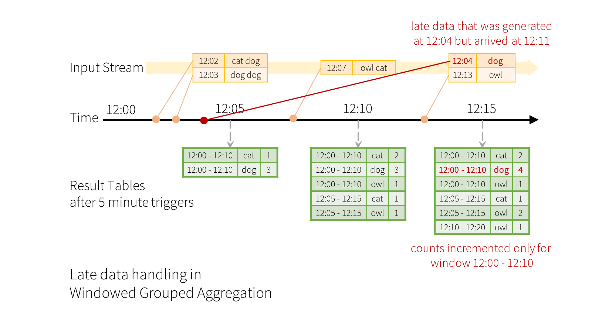
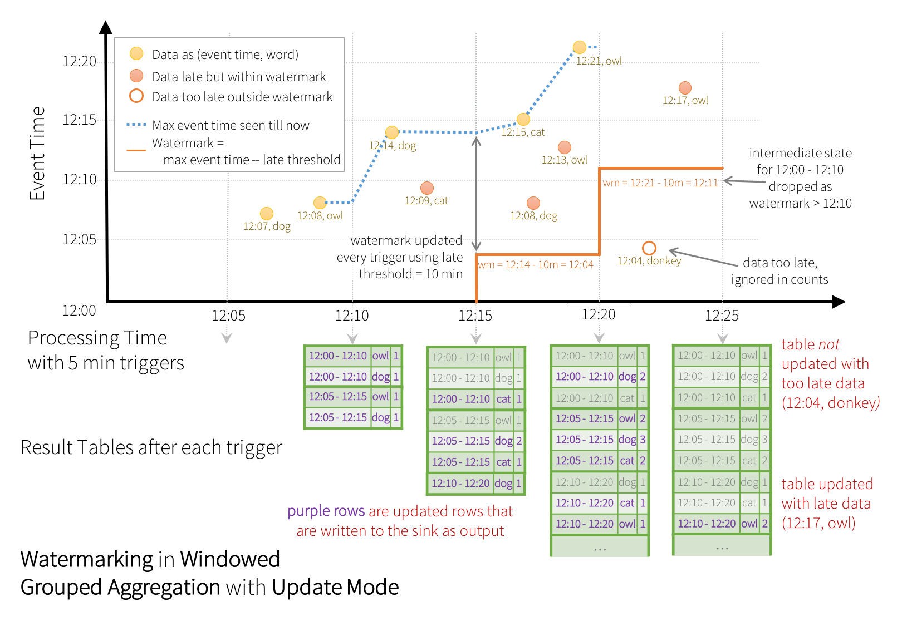

#### 阅读官方文档
* 只记录要点.

#### [RDD Programming Guide RDD编程指南](http://spark.apache.org/docs/latest/rdd-programming-guide.html) 
* RDD: 弹性分布式数据集的抽象
* 并行集合  
    * 如下方式创建spark并行集合
    >
        val data = Array(1, 2, 3, 4, 5)
        val distData = sc.parallelize(data)
    >
    * 并行集合有一个重要参数是将该集合进行分区的数量,spark会为每一个分区运行一个任务.
    * 通常情况下,每个cpu可分配2-4个分区.
    * 可自行传入参数指定分区数量,如下指定了10个分区(若不指定,则由spark自动分配)
    >   sc.parallelize(data, 10)

* spark读取文件的注意事项
    * 如果读取本地文件,则所有节点都需要可以在各自的本地访问到该文件.
    * spark所有基于文件的输入方法,支持目录/压缩文件和通配符.例如下面这些读取方式
    > textFile("/my/directory")，textFile("/my/directory/*.txt")和textFile("/my/directory/*.gz")
    * textFile()方法也可用参数[2]来控制分区数量.默认情况下,spark为文件的每个块创建一个分区
        (HDFS中,块默认为128M(注意,分区数不能小于块数目,也就是说分区数之内能比默认分区数大)).
    * SparkContext.wholeTextFiles()方法可以读取多个小文本文件的目录,将它作为scala中的  (filename, content) 对象返回.
        某些时候这样会导致分区数太少,所以该方法的参数[2]可以指定最小分区数量        
    * RDD.saveAsObjectFile()和SparkContext.objectFile()方法可以用由序列化java对象组成的简单格式,保存RDD    
* spark中,所有转换都是懒惰的.只会保存一些基础的Dataset(例如文件).只有当驱动程序需要结果时,才会进行计算(例如文件).(具体理解可参考下方法累加器例子)    
* 默认情况下,每次转换RDD时,都会重新计算(例如执行相同的filter,都会重新计算).可以使用persist()或cache()方法保存中间结果.  
    此外,还支持在本地持久化,或在集群中复制.     
    >
        如下代码.在第一行和第二行,读取文件时,spark不会马上进行计算,当最后reduce()方法时(这是一个行动),才会进行计算.
        val lines = sc.textFile("data.txt")
        val lineLengths = lines.map(s => s.length)
        val totalLength = lineLengths.reduce((a, b) => a + b)
        
        如果我们想在之后再次使用lineLengths对象,可以在reduce之前,使用lineLengths.persist(),将其保存在内存中
    >
* scala中,可以如下定义静态方法,然后可以在map()时调用; (和Java8中的方法引用类似)
    >
        object MyFunctions {
          def func1(s: String): String = { ... }
        }
        
        //调用
        myRdd.map(MyFunctions.func1)
    >
* 也可以将rdd对象传递给要调用的方法所属的类,进行引用
    >
        如下,doStuff方法接收任意rdd对象,在rdd.map()中调用自己的func1方法
        class MyClass {
          def func1(s: String): String = { ... }
          def doStuff(rdd: RDD[String]): RDD[String] = { rdd.map(func1) }
        }
    >

* 如下的计数器写法,在spark中不可取
    >
        var counter = 0
        var rdd = sc.parallelize(data)
        
        // Wrong: Don't do this!!
        rdd.foreach(x => counter += x)
        
        println("Counter value: " + counter)
    >
    * 集群中传递给其他节点的是副本等原因,会让原始计数器值为0, 本地也会有问题.
    * 可以使用下文提到的共享变量
    
* rdd.foreach(println)或rdd.map(println)打印所有元素的方法在集群中不可取.
    * 可以使用如下方式打印,但这样将整个RDD复制到了单个节点中,可能导致节点内存不足
    > rdd.collect().foreach(println)
    * 如果只需要打印一些元素,可以使用如下方式
    > rdd.take(100).foreach(println)
    
* 使用键值对.
    * 如下方式可以统计文本中每行文本出现的次数
    >
        val lines = sc.textFile("data.txt")  
        val pairs = lines.map(s => (s, 1)) //将每个元素做一个键值对映射,返回scala中的Tuple对象.
        val counts = pairs.reduceByKey((a, b) => a + b) //根据该对象的每个key(也就是每行文本),将相同key的value进行累加
    >
    * 在使用自定义对象作为键值对操作中的键时，必须确保自定义equals()方法附带匹配hashCode()方法

* Transformations: RDD常用转化操作
    * map(func): 返回一个新的分布式数据集,根据传入的每个元素.
    * filter(func): 返回一个新的分布式数据集,包含传入的匿名函数中返回值为true的那些元素
    * flatMap(func): 类似map(func),但匿名函数可以返回任意个输出值(所以该函数应该返回Seq(数组),而不是单个值)
    * mapPartitions(func): 类似map(func),但是在RDD的每个分区中单独运行.所以匿名函数的类型必须是`Iterator<T> => Iterator<U>`  ,T是RDD的每个元素类型.
    * mapPartitionsWithIndex(func): 类似mapPartitions(func),但为每个分区提供了单独的标志,表示分区的索引.所以,
        匿名函数的类型必须是` (Int, Iterator<T>) => Iterator<U> `
    * sample(withReplacement, fraction, seed): 使用给定的随机数方法,获取一部分数据样本
    * union(otherDataset): 取并集,将源数据和参数中的集合合并,返回一个新的集合
    * intersection(otherDataset):  取交集,返回两个集合中相同的数据
    * distinct([numTasks])): 返回所有不同的数据的集合.
    * groupByKey([numTasks]): 根据key分组,当(K, V)调用该方法时,返回(K, Iterable<V>)对象.  
        注意:如果调用该方法执行聚合操作(例如求平均值或求和),在每一个key上,使用reduceByKey()或aggregateByKey()性能更好  
        注意:默认情况下,输出的并行度取决于RDD的分区数,可以通过numTasks来设置不同的任务数量
    * reduceByKey(func, [numTasks]): 根据key分解,当(K, V)调用该方法时,返回(K, V)对象.并对每个key的value使用了传入的reduce()函数.  
        该函数必须是(V,V) => V,也就是将value两两操作.   
        也可以使用numTasks参数[2]来指定任务数量.
    * aggregateByKey(zeroValue)(seqOp, combOp, [numTasks]): 当(K, V)调用该方法时,返回(K, U)对象,
        对每个key的value使用给定的combine(联合)函数和一个中立的 "zero"值,进行聚合.允许一个和输入值类型不同的聚合值类型.   
        也可以使用numTasks参数[2]来指定任务数量.
    * sortByKey([ascending], [numTasks]): 根据key排序,使用匿名函数对key进行排序.
    * join(otherDataset, [numTasks]): 连接.当 (K, V)类型对(K, W)类型进行调用时,返回 (K, (V, W))类型,支持外连接,
        通过leftOuterJoin/rightOuterJoin/fullOuterJoin方法.
    * cogroup(otherDataset, [numTasks]): 当 (K, V)类型对(K, W)类型进行调用时,返回(K, (Iterable<V>, Iterable<W>))类型.
        这个操作也被称为groupWith.
    * cartesian(otherDataset): 当T类型对U类型调时,返回 (T, U) 类型.
    * pipe(command, [envVars]): 通过shell命令对RDD的每个分区进行管道操作(例如perl或bash script).RDD被输入到进程的
        stdin(标准输入,控制台)中,然后从stdout(标准输出)中以string的形式输出.
    * coalesce(numPartitions):  合并,减少RDD的分区数到指定分区(numPartitions).在大数据集合过滤后,可以更有效的操作.
    * repartition(numPartitions): 重新分配,对RDD中的数据进行随机重组，以创建更多或更少的分区，并在它们之间进行平衡。
        这通常会使网络上的所有数据都被打乱。
    * repartitionAndSortWithinPartitions(partitioner): 重新分配&在分区内排序,根据给定的分区数重新分区RDD，在每个结果分区中，根据它们的键对记录进行排序.  
        这比repartition(numPartitions)更有效,因为它可以将sorting down 推送到 shuffle(洗牌)机器中.
        
* Actions: 常用动作操作
    * reduce(func): 简化,使用匿名函数聚合集合的每个元素.需要两个参数,返回一个对象.
        这个函数应该是可交换的(commutative )和结合(associative)的，这样它就可以在并行计算中得到正确的计算  
    * collect(): 返回包含所有元素的数组,通常在过滤等操作后使用.
    * count(): 返回当前元素个数.
    * first(): 返回第一个元素.
    * take(n): 返回前n个元素.
    * takeSample(withReplacement, num, [seed]): 随机返回num个元素
    * takeOrdered(n, [ordering]): 返回前n个元素,可以进行排序
    * saveAsTextFile(path): 保存为一个文本文件或一组文本文件(可用hdfs,或其他任何hadoop支持的文件系统).  
        spark会调用toString方法将每个元素转为文件中的每行文本.
    * saveAsSequenceFile(path): 类似上面.
    * saveAsObjectFile(path):  保存为文件,对每个元素使用java的序列化机制,可以使用SparkContext.objectFile()方法读取保存的文件.
    * countByKey(): 根据key统计个数.只支持 (K, V)类型,返回 (K, Int)类型的hashMap
    * foreach(func): 循环.
* 还有一些异步操作,比如foreach的异步版本foreachAsync()方法,将返回一个FutureAction.

* shuffle:洗牌操作. spark中的某些动作会触发shuffle事件.shuffle是spark重新分配数据的机制,以便在不同分区之间分组.  
    这通常涉及在执行者和机器之间复制数据，使得洗牌成为复杂而昂贵的操作。
    * 例如reduceByKey()方法.该方法将每个key的所有值组合在一起.但不是每个key的所有值都在同一分区中,所以,就需要进行洗牌操作,将每个key的所有值读取到各自的同一分区.
    * 虽然shuffle后的每个分区中的元素是确定的,分区本身的排序也是确定的,但每个分区中元素的排序却不确定.如果需要shuffle后返回可预测的有序数据:  
        * 可以使用mapPartitions 对每个分区进行排序,例如 .sorted (没看懂,例如什么..)
        * 也可用sortBy,创建一个全局有序的RDD.
        * repartitionAndSortWithinPartitions ,可以有效分区,同时重新分区
    * 会触发shuffle的操作:
        * repartition重新分区操作,例如 repartition 和coalesce
        * 'ByKey'操作(除了计数的),例如groupByKey 和 reduceByKey
        * join 操作,例如 cogroup 和 join
    * shuffle会产生大量中间文件(当数据过大不适合存储在内存中时),从spark1.3开始,这些文件被保留,直到相应的RDD被GC.临时文件目录配置(spark.local.dir 参数)

* 持久化RDD
    * 当持久化一个rdd时,每个节点都会存储该rdd在内存计算中的所有分区.Spark的缓存是容错的,如果RDD的任何分区丢失，它将自动使用最初创建它的转换方法重新计算。
    * 可以使用一个persist()或者多个cache()来标记一个RDD.
    * 此外，每个持久化的RDD都可以使用不同的存储级别存储，例如，可以在磁盘上持久化数据集，将其持久化到内存中，  
        但作为序列化的Java对象(为了节省空间)，可以跨节点复制它。
    * 该级别通过传递StorageLevel 参数给persist()方法指定.
    *  cache()方法默认使用StorageLevel.MEMORY_ONLY 的存储级别(存储在反序列化对象在内存中). 
    * 详细级别参考文档.
    * Spark会自动监视每个节点上的高速缓存使用情况，并以最近最久最少使用（LRU）方式删除旧的数据分区。RDD.unpersist()方法可手动删除.
* 共享变量. 通常,在远程集群中进行spark操作(例如map/reduce)时,每个节点都会对函数中使用的所有变量进行复制.并且当其修改后不会影响到其它节点.  
    支持读写共享的变量是低效的,spark只提供两种方式,共享变量.
    * 广播变量. 允许在每个节点保存一个只读变量,而不是将它复制到每个节点中去.
        * 只有跨多个阶段的任务需要相同的数据或以反序列化的形式缓存数据时，显式创建广播变量才是有用的。
        * 创建广播变量,并通过value方法访问广播变量
            >
                val broadcastVar = sc.broadcast(Array(1, 2, 3))
                broadcastVar.value
            >
    * Accumulators 累加器. 
        * 创建,并使用累加器. 提供了SparkContext.longAccumulator()或SparkContext.doubleAccumulator() 分别用于累加long和double类型的值.
            >
                val accum = sc.longAccumulator("My Accumulator")
                sc.parallelize(Array(1, 2, 3, 4)).foreach(x => accum.add(x))
                
                每个节点无法读取累加器的值, 只有在驱动程序处,才可以.
                accum.value
            >
        * 可以通过继承AccumulatorV2类,创建自己的累加器.
            * 必须重写这些方法: reset将累加器重置为零，add向累加器中添加另一个值，merge将另一个相同类型的累加器合并到该累加器中
            * 例如，假设我们有一个MyVector表示数学向量的类，我们可以这样写：
                >
                    //自定义累加器类,继承AccumulatorV2
                    class VectorAccumulatorV2 extends AccumulatorV2[MyVector, MyVector] {
                    
                      private val myVector: MyVector = MyVector.createZeroVector
                      //重写重置方法
                      def reset(): Unit = {
                        myVector.reset()
                      }
                      //重写累加方法
                      def add(v: MyVector): Unit = {
                        myVector.add(v)
                      }
                      ...
                    }
                    
                    // 创建该累加器
                    val myVectorAcc = new VectorAccumulatorV2
                    // 将其注册到 spark context 中.
                    sc.register(myVectorAcc, "MyVectorAcc1")
                >
        * 对于Actions动作类型方法,spark保证每个任务对累加器的更新只应用一次,即重新启动的任务不会更新值.   
            在Transformations转换类型方法中,如果任务或作业阶段被重新执行，每个任务的更新可能会被应用多次.
        * 由于spark是lazy(懒惰加载的,上文提到过),如果只是转换操作,并不会马上计算值,因此,如下代码的结果,累加器仍是0
            >
                val accum = sc.longAccumulator
                data.map { x => accum.add(x); x }
                
                //进行完map这个转换操作后,并没有继续执行动作类型方法.
            >


#### [Spark SQL, DataFrames and Datasets Guide ](http://spark.apache.org/docs/latest/sql-programming-guide.html)
* Dataset 是分布式数据集合.在spark1.6时被加入. 
    * 可以从JVM对象构造Dataset，(可以将其理解为泛型为java bean的集合)然后使用功能转换(map、flatMap、filter等)进行操作
* DataFrame 是一个对列命名了的Dataset.可理解为数据库中的表.
    * 可以从如下数据源中构建: 结构化的数据文件/ hive中的表 / 外部数据源(mysql等)/ 存在的RDDs.
    * 在scala中.DataFrame是简单的 Dataset[Row]类型的别名.在java中,可用 Dataset<Row>表示一个DataFrame.
    
* SparkSession. spark中所有功能的起始类.
    * 创建SparKSession.
        >
            import org.apache.spark.sql.SparkSession
            
            val spark = SparkSession
              .builder()//构造器类
              .appName("Spark SQL basic example")//应用名
              .config("spark.some.config.option", "some-value")//配置key/value参数
              .getOrCreate()
              
            // 对于 隐式转换,例如RDDs转为DataFrames,需要这样导入.
            import spark.implicits._
        > 
* Spark2.0中提供了对Hive功能的支持,并且不需要安装一个Hive.(也就是说可以直接写sql操作数据集)
* 基于json文件创建DataFrame:
    >
        val df = spark.read.json("examples/src/main/resources/people.json")
        // 输出内容到控制台
        df.show()
    >
* Untyped Dataset Operations 非Dateset操作(又名 : DataFrame操作)
    >
        基于上面读取到的df对象
        //使用$,需要导入这个.
        import spark.implicits._
        //输出该对象的树型结构
        df.printSchema()
        // '$' 应该是 df.col('xxx')的缩写
        df.select("name").show()
        df.select($"name", $"age" + 1).show()
        df.filter($"age" > 21).show()
        df.groupBy("age").count().show()
    >

* 以sql的形式运行.
    >
        // 用DataFrame创建一个临时视图
        df.createOrReplaceTempView("people")
        //使用sql查询
        val sqlDF = spark.sql("SELECT * FROM people")
        sqlDF.show()
    >
* Global Temporary View : 全局临时视图
    * spark中的临时视图是session(应该指一个spark-shell这样的命令行)范围的.如果需要一个在所有session中共享,并且保持到spark程序终止的视图.  
        可以创建一个全局临时视图,它自动绑定到系统提供的global_temp数据库中.  
        必须使用这样的名字来使用它.例如 SELECT * FROM global_temp.view1
        >
            //创建全局临时视图  
            df.createGlobalTempView("people")
            //查询sql的表名需要增加数据库名前缀.
            spark.sql("SELECT * FROM global_temp.people").show()
        >
* 创建Dataset
    * Dataset和RDDs类似,但它未使用Java序列化或Kryo,而是使用专门的编码器来序列化对象,以便在网络中传输.
    * 虽然编码器和标准序列化都负责将对象转换为字节,编码器是动态生成的代码，并使用一种格式，它允许Spark执行许多操作，  
        如过滤、排序和散列，而不将字节反序列化为对象。
    >
        //注意: Case classes在spark2.10中,只支持22个字段,如需扩展,可自定义类.
        case class Person(name: String, age: Long)
        
        //使用case class 创建一个Dataset编码器
        val caseClassDS = Seq(Person("Andy", 32)).toDS()
        caseClassDS.show()
        
        //大多数通用类型的编码器是通过  importing spark.implicits._ 自动提供的.
        val primitiveDS = Seq(1, 2, 3).toDS()
        primitiveDS.map(_ + 1).collect() // Returns: Array(2, 3, 4)
        
        //通过提供一个class,可以将DataFrame 转为 Dataset , 将通过属性名进行映射
        val path = "examples/src/main/resources/people.json"
        val peopleDS = spark.read.json(path).as[Person]
        peopleDS.show()
    >

* spark支持两种不同的方法将存在的RDDs转换为Dataset
    * 第一个方法使用反射来推断一个包含特定对象类型的RDD的schema.该方法代码更简洁，如果在编写Spark应用程序时就已经知道了schema
    * 第二种方法是通过一个编程接口，它允许您构造一个模式，然后将其应用到现有的RDD中。  
        虽然这个方法比较冗长，但是它允许您在运行时构造数据集,它们的类型直到运行时才知道.  
        也就是无法提前定义case class时,例如记录的结构是用字符串编码的??/一个文本的dataset将被解析等
    * 方法一: 通过反射推断schema.
        * scala的spark sql接口支持自动将包含case class类的RDD转换为Dataset.这个case class定义了它的schema.  
            对于case class的参数名称是通过反射读取的.case class也可以包含或嵌套复杂的类型,例如Seq或Array.  
            可以将这个RDD隐式地转换为Dataset,然后将其注册为一个表,然后使用sql语句进行后续操作
        >
            // 从RDDs到DataFrames的隐式转换
            import spark.implicits._
            
            //RDD => DataFrame 读取文件,使用逗号分割每一行,用分割后的每一数组创建一个Person对象. 将其转为DataFrame
            val peopleDF = spark.sparkContext
              .textFile("examples/src/main/resources/people.txt")
              .map(_.split(","))
              .map(attributes => Person(attributes(0), attributes(1).trim.toInt))
              .toDF()
              
            //注册为临时表, 进行spark sql 操作.
            peopleDF.createOrReplaceTempView("people")
            val teenagersDF = spark.sql("SELECT name, age FROM people WHERE age BETWEEN 13 AND 19")
            //结果中的每一行的字段可以通过索引访问
            teenagersDF.map(teenager => "Name: " + teenager(0)).show()
            //或者通过字段名
            teenagersDF.map(teenager => "Name: " + teenager.getAs[String]("name")).show()
            
            //对于 Dataset[Map[K,V]]没有预先定义编码器. 
            implicit val mapEncoder = org.apache.spark.sql.Encoders.kryo[Map[String, Any]]
            //基本类型和 case classes 也可以定义为
            // implicit val stringIntMapEncoder: Encoder[Map[String, Any]] = ExpressionEncoder()
            
            //row.getValuesMap[T]  一次检索多个列,映射为一个 Map[String, T]
            teenagersDF.map(teenager => teenager.getValuesMap[Any](List("name", "age"))).collect()  
            //返回的是 Array(Map("name" -> "Justin", "age" -> 19))
        >
    * 方法二:以编程方式转换,分为三个步骤
        * 从原始的RDD转为一个以Row为泛型的RDD
        * 创建和第一步的Row相匹配的StructType类.
        * 通过SparkSession.createDataFrame方法,使用RDD和StructType创建DataFrame
        >
            //使用sparkContext将文件读取为RDD[String]
            val rdd = sparkSession.sparkContext.textFile("C:\\Users\\97038\\Desktop\\info.txt")
        
            //从原始的RDD转为一个以Row为泛型的RDD.
            val infoRDD = rdd.map(row => row.split(",")).map(field => Row(field(0).toInt, field(1), field(2).toInt))
        
            //创建和第一步的Row相匹配的StructType类. 定义结构类型,需要传入一个数组,该数组每个元素是一个字段,每个字段需要传入 字段名/字段类型/是否能为空
            val structType = StructType(Array(
              StructField("id", IntegerType, nullable = true),
              StructField("name", StringType, nullable = true),
              StructField("age", IntegerType, nullable = true)))
        
            //通过 RDD对象和其对应的StructType对象 创建出 DataFrame
            val infoDF = sparkSession.createDataFrame(infoRDD, structType)
            infoDF.show()
        >
* Aggregations 聚合
    * DataFrame提供了 count(), countDistinct(), avg(), max(), min()等方法
    * Untyped的自定义聚合函数,通过实现 UserDefinedAggregateFunction抽象类.
        >
            //如果定义了一个简单的求平均数的聚合函数. 
            object MyAverage extends UserDefinedAggregateFunction {
              // 该聚合函数输入参数的数据类型
              def inputSchema: StructType = StructType(StructField("inputColumn", LongType) :: Nil)
              // 聚合缓冲区 中的值的数据类型
              def bufferSchema: StructType = {
                StructType(StructField("sum", LongType) :: StructField("count", LongType) :: Nil)
              }
              // 返回值的数据类型
              def dataType: DataType = DoubleType
              // 该聚合函数是否幂等
              def deterministic: Boolean = true
              // 初始化给定的聚合缓冲区.
              // 该缓冲区是一个Row,除了提供标准方法,像通过索引检索值(例如get()/getBoolean()),还提供了修改值的机会
              // 注意:缓冲区内的 array 和 map 是不可变的.
              def initialize(buffer: MutableAggregationBuffer): Unit = {
                buffer(0) = 0L
                buffer(1) = 0L
              }
              // 使用新的输入数据来更新聚合缓冲区的值
              def update(buffer: MutableAggregationBuffer, input: Row): Unit = {
                if (!input.isNullAt(0)) {
                  buffer(0) = buffer.getLong(0) + input.getLong(0)
                  buffer(1) = buffer.getLong(1) + 1
                }
              }
              // 合并两个集合缓冲区,并将更新后的缓冲区的值 赋值给buffer1
              def merge(buffer1: MutableAggregationBuffer, buffer2: Row): Unit = {
                buffer1(0) = buffer1.getLong(0) + buffer2.getLong(0)
                buffer1(1) = buffer1.getLong(1) + buffer2.getLong(1)
              }
              // 计算出最终结果
              def evaluate(buffer: Row): Double = buffer.getLong(0).toDouble / buffer.getLong(1)
            }
            
            // 注册该函数以访问它
            spark.udf.register("myAverage", MyAverage)
            
            //读取json文件,创建临时表
            val df = spark.read.json("examples/src/main/resources/employees.json")
            df.createOrReplaceTempView("employees")
            df.show()
            // +-------+------+
            // |   name|salary|
            // +-------+------+
            // |Michael|  3000|
            // |   Andy|  4500|
            // | Justin|  3500|
            // |  Berta|  4000|
            // +-------+------+
            
            // 使用自定义聚合函数
            val result = spark.sql("SELECT myAverage(salary) as average_salary FROM employees")
            result.show()
            // +--------------+
            // |average_salary|
            // +--------------+
            // |        3750.0|
            // +--------------+
        >    
    * Type-Safe的用户自定义函数
        >
            //定义 员工  类型
            case class Employee(name: String, salary: Long)
            //定义 聚合函数 缓冲区  类型
            case class Average(var sum: Long, var count: Long)
            
            object MyAverage extends Aggregator[Employee, Average, Double] {
              // 这个集合函数的0值. 应该满足任意的 b + zero = b
              def zero: Average = Average(0L, 0L)
              // 结合两个值来生成一个新值. 为了性能,这个方法可以修改buffer,返回原对象,而不是返回一个新对象
              def reduce(buffer: Average, employee: Employee): Average = {
                buffer.sum += employee.salary
                buffer.count += 1
                buffer
              }
              // 合并两个中间值,同样赋值给b1
              def merge(b1: Average, b2: Average): Average = {
                b1.sum += b2.sum
                b1.count += b2.count
                b1
              }
              // 使用新的输入数据来更新聚合缓冲区的值 reduce
              def finish(reduction: Average): Double = reduction.sum.toDouble / reduction.count
              // 指定中间值类型的 Encoder
              def bufferEncoder: Encoder[Average] = Encoders.product
              // 指定最终输出值类型的 Encoder
              def outputEncoder: Encoder[Double] = Encoders.scalaDouble
            }
            
            val ds = spark.read.json("examples/src/main/resources/employees.json").as[Employee]
            ds.show()
            // +-------+------+
            // |   name|salary|
            // +-------+------+
            // |Michael|  3000|
            // |   Andy|  4500|
            // | Justin|  3500|
            // |  Berta|  4000|
            // +-------+------+
            
            // 将该类转换为TypedColumn类型,并给他命名, 然后调用他.
            val averageSalary = MyAverage.toColumn.name("average_salary")
            val result = ds.select(averageSalary)
            result.show()
            // +--------------+
            // |average_salary|
            // +--------------+
            // |        3750.0|
            // +--------------+
        >
* Data Sources 数据源.
    * spark sql 支持操作多种数据源,通过DataFrame接口.
    * 简单的 加载/保存 方法. 默认使用parquet格式,可以通过参数 spark.sql.sources.default 修改默认格式
        >
            val usersDF = spark.read.load("examples/src/main/resources/users.parquet")
            usersDF.select("name", "favorite_color").write.save("namesAndFavColors.parquet")
        >
    * 手动指定数据源
        * 可以通过全类名指定数据源(例如,org.apache.spark.sql.parquet),如果是内置数据源,可以使用简单名称(例如,json, parquet, jdbc, orc, libsvm, csv, text)  
        * 从任何数据源加载的DataFrame都可以使用这种语法转换为其他类型    
        >
            //加载json文件,取出每个元素的 name age 字段, 保存为 parquet格式文件.
            val peopleDF = spark.read.format("json").load("examples/src/main/resources/people.json")
            peopleDF.select("name", "age").write.format("parquet").save("namesAndAges.parquet")
        >
* 直接在文件上运行sql
    >
        val sqlDF = spark.sql("SELECT * FROM parquet.`examples/src/main/resources/users.parquet`")
    >
    
* 保存模式 Save Modes
    * 保存操作可以选择使用SaveMode,它指定了如何处理已经存在的数据 
        注意:这些保存模式,不使用任何锁,也不是原子的.此外,在overwrite模式时,在写出这些新数据前,旧数据将被删除.
    * 如下模式
        >
            SaveMode.ErrorIfExists: 保存数据时,如果数据已存在,抛出异常.
            SaveMode.Append: 追加.
            SaveMode.Overwrite: 重写.
            SaveMode.Ignore: 如果存在,不进行任何操作,类似于sql的  CREATE TABLE IF NOT EXISTS 
        >
* 保存为持久化的表
    * DataFrame可以使用saveAsTable命令在hive metastore中保存持久化的表.注意,不需要部署hive,或使用存在的hive.  
        spark将创建默认的本地元数据(使用Derby数据库(spark自带的数据库)).  
    * 和createOrReplaceTempView不同,saveAsTable将DataFrame的内容具体化,并创建一个指针指向在hive metastore.  
    * 该表在spark重启后仍然存在,只要hive的metastore不变.
    * 对于基于文件的数据源,例如text,json,parquet,可以使用path指定自定义表路径,   
        例如 df.write.option("path", "/some/path").saveAsTable("t"). 当删除表时,将不会删除自定义表路径,而表的数据仍会保存在那.  
        如果没有指定自定义表路径,spark会将其写到仓库目录下的默认表路径.当删除表时,默认的表路径也会被删除.
    * 从spark2.1开始,持久化的表在hive metastore的每个分区中保存自己的metadata.这可以带来一些好处:  
        由于一个查询,Metastore只能返回需要的分区，因此不再需要在第一个查询中发现所有分区;  
         ALTER TABLE PARTITION ... SET LOCATION 这样的语句可以对在 Datasource API创建的表使用.
    * 注意,当创建外部数据源表(带有path选项的表)时，分区信息不会被默认收集。要在metastore中同步分区信息，可以调用MSCK REPAIR TABLE
    
* Bucketing, Sorting and Partitioning 桶/排序/分区 (hive中的概念)
    * 如下操作
        >
            peopleDF.write.bucketBy(42, "name").sortBy("age").saveAsTable("people_bucketed")
            usersDF.write.partitionBy("favorite_color").format("parquet").save("namesPartByColor.parquet")
            peopleDF.write.partitionBy("favorite_color").bucketBy(42, "name").saveAsTable("people_partitioned_bucketed")
        >

* Parquet 文件, 支持列存储的文件,在spark中,由于兼容性原因,所有列都时可为空的.

* Partition Discovery 分区发现
    * 表分区时hive中常用的优化方法.在分区表中,数据通常存储在不同的目录中,在每个分区目录中使用分区列值区分.
    * 所有内置文件源(包括Text/CSV/JSON/ORC/Parquet)可以自动发现和推断分区信息.
    * 在例子中,如下目录结构,使用 gender和country作为分区列
        >
            path
            └── to
                └── table
                    ├── gender=male
                    │   ├── ...
                    │   │
                    │   ├── country=US
                    │   │   └── data.parquet
                    │   ├── country=CN
                    │   │   └── data.parquet
                    │   └── ...
                    └── gender=female
                        ├── ...
                        │
                        ├── country=US
                        │   └── data.parquet
                        ├── country=CN
                        │   └── data.parquet
                        └── ...
        > 
    * 使用 SparkSession.read.load 一类的命令,读取path/to/table目录的数据时,spark sql 将自动从路径中提取分区信息,
        则返回的DataFrame的schema如下(包含了分区列的值):
        >
            root
            |-- name: string (nullable = true)
            |-- age: long (nullable = true)
            |-- gender: string (nullable = true)
            |-- country: string (nullable = true)
        >
        * 注意,这些分区列的类型时自动推导的,当前支持 数字类型/日期/时间戳/字符串 类型.  
            如果不希望自动推导分区列的类型,可以使用spark.sql.sources.partitionColumnTypeInference.enabled参数关闭它,则会使用string类型.
        * 如上例子中,如果指定的加载path是path/to/table/gender=male,则gender 不会作为一个分区列

* Schema Merging 
    * 像ProtocolBuffer/Avro/Thrift一样, parquet也支持 schema evolution. 可以从简单的schema开始,根据需要,添加更多的列.  
         通过这种方式,可能会有多个不同的但schema相互兼容的Parquet文件   
    * 由于该合并消耗性能和资源,spark1.5开始默认关闭了他.
        * 可以设置mergeSchema 为true开启(看下列例子)
        * 也可以设置全局的spark属性spark.sql.parquet.mergeSchema
    * 例子如下:
        >
            // 隐式转换
            import spark.implicits._
            
            // 创建一个简单的DataFrame,存储到分区目录中
            val squaresDF = spark.sparkContext.makeRDD(1 to 5).map(i => (i, i * i)).toDF("value", "square")
            squaresDF.write.parquet("data/test_table/key=1")
            
            // 在新的分区目录,再创建一个DataFrame
            // 新增一个列,并删除一个已存在的列
            val cubesDF = spark.sparkContext.makeRDD(6 to 10).map(i => (i, i * i * i)).toDF("value", "cube")
            cubesDF.write.parquet("data/test_table/key=2")
            
            // 读取整个分区表
            val mergedDF = spark.read.option("mergeSchema", "true").parquet("data/test_table")
            //打印schema
            mergedDF.printSchema()
            
            // 该schema中最终包含了分区列key, 并兼容了square和cube字段.
            // root
            //  |-- value: int (nullable = true)
            //  |-- square: int (nullable = true)
            //  |-- cube: int (nullable = true)
            //  |-- key: int (nullable = true)
        >

* Hive metastore Parquet table conversion
    * 当读写Hive metastore parquet 的表时,spark sql将尝试使用自己的parquet支持,而不使用Hive SerDe,以提高性能.  
        可通过spark.sql.hive.convertMetastoreParquet 参数控制,默认开启.

* metadata 刷新
    * Spark SQL缓存了Parquet元数据，以获得更好的性能。当启用了convertMetastoreParquet时，也会缓存那些转换后的表的元数据。如果使用Hive或其他外部工具更新这些表，则需要手动刷新它们，
        >
            //spark is an existing SparkSession
            spark.catalog.refreshTable("my_table") 
        >
* 配置 详见文档 Configuration
    * 可以通过SparkSession的setConf方法,或SET key=value命令设置.
    
* JSON Dataset
    * spark sql 可以自动推导json的schema,并加载其为Dataset[Row], 该转换可以通过对Dataset[String]数据使用SparkSession.read.json() 完成, 或者json file.
    * 注意,提供的json file不是普通的json file,具体查看 [ JSON行文本格式](http://jsonlines.org/)
        * 主要是 使用UTF-8编码, 以\n分隔行,用.jsonl后缀
        * 对于常规的多行JSON文件，需将multiLine选项设置为true
    * 例子
        >
            // 在创建Dataset时, 导入如下,支持基本数据类型 (Int, String, etc) 和 Product 类型 (case classes) 编码
            import spark.implicits._
            
            // 路径可以是一个文本文件，也可以是一个存储文本文件的目录
            val path = "examples/src/main/resources/people.json"
            val peopleDF = spark.read.json(path)
            
            // 输出 schema
            peopleDF.printSchema()
            // root
            //  |-- age: long (nullable = true)
            //  |-- name: string (nullable = true)
            
            // 临时表
            peopleDF.createOrReplaceTempView("people")
            
            // SQL 
            val teenagerNamesDF = spark.sql("SELECT name FROM people WHERE age BETWEEN 13 AND 19")
            teenagerNamesDF.show()
            // +------+
            // |  name|
            // +------+
            // |Justin|
            // +------+
            
            // 由一个Dataset[String]转换,其中的string需要是json格式
            val otherPeopleDataset = spark.createDataset(
              """{"name":"Yin","address":{"city":"Columbus","state":"Ohio"}}""" :: Nil)
            val otherPeople = spark.read.json(otherPeopleDataset)
            otherPeople.show()
            // +---------------+----+
            // |        address|name|
            // +---------------+----+
            // |[Columbus,Ohio]| Yin|
            // +---------------+----+
        >

* Hive Table
    * spark默认分支不包含hive依赖,但当导入hive依赖后,spark自动支持hive. 注意,所有节点都必须有该hive依赖.
    * 配置hive通过放置hive-site.xml / core-site.xml (安全配置) 和 hdfs-site.xml (HDFS配置)在conf/目录下.
    * 当没有hive-site.xml时,context自动创建metastore_db 在当前目录,并创建一个spark.sql.warehouse.dir参数配置的目录.等
    * 代码
        >
            case class Record(key: Int, value: String)
            
            // warehouseLocation指向托管数据库和表的默认位置
            val warehouseLocation = new File("spark-warehouse").getAbsolutePath
            
            val spark = SparkSession
              .builder()
              .appName("Spark Hive Example")
              .config("spark.sql.warehouse.dir", warehouseLocation)
              .enableHiveSupport()
              .getOrCreate()
            
            import spark.implicits._
            import spark.sql
            
            sql("CREATE TABLE IF NOT EXISTS src (key INT, value STRING) USING hive")
            sql("LOAD DATA LOCAL INPATH 'examples/src/main/resources/kv1.txt' INTO TABLE src")
            
            // Queries are expressed in HiveQL
            sql("SELECT * FROM src").show()
            // +---+-------+
            // |key|  value|
            // +---+-------+
            // |238|val_238|
            // | 86| val_86|
            // |311|val_311|
            // ...
            
            // Aggregation queries are also supported.
            sql("SELECT COUNT(*) FROM src").show()
            // +--------+
            // |count(1)|
            // +--------+
            // |    500 |
            // +--------+
            
            // SQL查询的结果本身就是DataFrames，并支持所有的正常函数。
            val sqlDF = sql("SELECT key, value FROM src WHERE key < 10 ORDER BY key")
            
            // DataFrames中的每一元素是Row类型, 如下,顺序输出每一行的值 (ps: s"Key: $key, Value: $value" 类似 system.out.format)
            val stringsDS = sqlDF.map {
              case Row(key: Int, value: String) => s"Key: $key, Value: $value"
            }
            stringsDS.show()
            // +--------------------+
            // |               value|
            // +--------------------+
            // |Key: 0, Value: val_0|
            // |Key: 0, Value: val_0|
            // |Key: 0, Value: val_0|
            // ...
            
            // You can also use DataFrames to create temporary views within a SparkSession.
            val recordsDF = spark.createDataFrame((1 to 100).map(i => Record(i, s"val_$i")))
            recordsDF.createOrReplaceTempView("records")
            
            // Queries can then join DataFrame data with data stored in Hive.
            sql("SELECT * FROM records r JOIN src s ON r.key = s.key").show()
            // +---+------+---+------+
            // |key| value|key| value|
            // +---+------+---+------+
            // |  2| val_2|  2| val_2|
            // |  4| val_4|  4| val_4|
            // |  5| val_5|  5| val_5|
            // ...
        >

* 为hive表指定 存储格式
    * 当创建一个hive表时,需要定义输入格式和输出格式.还需定义serde(序列化方式)        
    * 下列选项可用来指定存储格式,例如CREATE TABLE src(id int) USING hive OPTIONS(fileFormat 'parquet')
    * 详看文档,就是类似用 \t 或者 " "分割之类的格式定义

* 与不同版本的Hive Metastore交互 详看文档

* JDBC到其他数据库
    * 该操作在执行时,需要指定数据库对应的jdbc驱动(还有事物隔离级别等若干属性详见文档)
        > bin/spark-shell --driver-class-path postgresql-9.4.1207.jar --jars postgresql-9.4.1207.jar
    * 代码
        >
            // Note: JDBC loading and saving can be achieved via either the load/save or jdbc methods
            // 方法一
            val jdbcDF = spark.read
              .format("jdbc")
              .option("url", "jdbc:postgresql:dbserver")
              .option("dbtable", "schema.tablename")
              .option("user", "username")
              .option("password", "password")
              .load()
            
            //方法二
            val connectionProperties = new Properties()
            connectionProperties.put("user", "username")
            connectionProperties.put("password", "password")
            val jdbcDF2 = spark.read
              .jdbc("jdbc:postgresql:dbserver", "schema.tablename", connectionProperties)
            
            // Saving data to a JDBC source
            jdbcDF.write
              .format("jdbc")
              .option("url", "jdbc:postgresql:dbserver")
              .option("dbtable", "schema.tablename")
              .option("user", "username")
              .option("password", "password")
              .save()
            
            jdbcDF2.write
              .jdbc("jdbc:postgresql:dbserver", "schema.tablename", connectionProperties)
            
            // Specifying create table column data types on write
            jdbcDF.write
              .option("createTableColumnTypes", "name CHAR(64), comments VARCHAR(1024)")
              .jdbc("jdbc:postgresql:dbserver", "schema.tablename", connectionProperties)
        >

* Performance Tuning 性能调优
    * 缓存数据在内存
        * 缓存: spark.catalog.cacheTable("tableName") ;  删除缓存: spark.catalog.uncacheTable("tableName")
    * 其他见文档

* 分布式SQL引擎 (其他详见文档)
    * thriftserver用于jdbc的连接的服务,和hive中的hiveserver一样.
    * beeline,连接到thriftserver进行操作的命令行服务,和hvie中的beeline相同
    
    * 启动thriftserver,默认端口10000
        >
            ./sbin/start-thriftserver.sh --master local[2] --jars /zx/hive/lib/mysql-connector-java-5.1.36.jar
            可通过--hiveconf hive.server2.thrift.port=xxxx 修改默认端口
            --hiveconf hive.server2.thrift.bind.host=xxx 修改绑定主句主机
            
            启动成功后使用jps -m可查看到一个对应的SparkSubmit  
            可访问4040端口,并可以通过JDBC/ODBC Server页面查看到当前的连接,通过SQL页面查看到执行的sql记录(执行计划等)
            停止执行stop-thriftserver.sh
        >
    * 启动beeline
        >
            beeline -u jdbc:hive2://localhost:10000 -n root
            -u是thriftserver的连接路径, -n是当前的linux用户(root)
            
            和操作spark-sql一样即可.
            查看所有表
            show tables;
        >
    
    * thriftserver和spark-shell/spark-sql有什么区别  
        * spark-shell/spark-sql都是一个spark application
        * thriftserver,不管启动多少个客户端(beeline或java api等),都是一个spark application
            并且,多个客户端间可以共享缓存数据等.
    


### [Structured Streaming Programming Guide ](http://spark.apache.org/docs/latest/structured-streaming-programming-guide.html)
Structured Streaming 是可扩展的/容错的/构建于SparkSQL之上的流处理引擎.

#### 实例: 基于TCP Socket 进行接收的文本的 Word Count  
- 先构建SparkSession,通过它创建一个监听localhost：9999的服务器,并将接收到的数据转换为DataFrame以计算字数
```
import org.apache.spark.sql.functions._
import org.apache.spark.sql.SparkSession

val spark = SparkSession
  .builder
  .appName("StructuredNetworkWordCount")
  .getOrCreate()
  
import spark.implicits._


// 这个linesDataFrame表示一个包含流文本数据的无界表。该表包含一列属性名为“value”的字符串
val lines = spark.readStream
  .format("socket")
  .option("host", "localhost")
  .option("port", 9999)
  .load()

// Split the lines into words
val words = lines.as[String].flatMap(_.split(" "))

// Generate running word count
val wordCounts = words.groupBy("value").count()
```
- 如上,lines读取到的是若干行接收到的文本. 然后将其转为string格式,然后使用flatMap,并在其中进行分割.最终会获取到输入的若干行文本的所有单词.(但此时还未运行)

- 运行该服务,并将结果输出到控制台
```
// Start running the query that prints the running counts to the console
val query = wordCounts.writeStream
  .outputMode("complete")
  .format("console")
  .start()
//等待服务关闭再往后运行
query.awaitTermination()
```

- 在服务器上,可以如下开始运行/关闭
```
./bin/run-example org.apache.spark.examples.sql.streaming.StructuredNetworkWordCount localhost 9999
nc -lk 9999
```

- 基本概念  
将输入数据流看作 '输入表',到达流中的每个数据项像行一样被追加d到无界输入表中


- 对输入表进行一系列查询(filter/map等或sql操作)将生成“结果表”。  
每一个触发间隔（比如说，每隔1秒），新的行会被附加到输入表，经过一系列查询,最终更新结果表。  
每当结果表得到更新时，都将更改的结果行写入外部接收器。


- 输出是指将表中内容写出到外部存储器.有如下模式
    - Complete Mode(完整模式): 整个更新后的结果表将被写入到外部存储器
    - Append Mode(追加模式): 只有上个触发器执行之后表中新增的结果行才会被写入外部存储器.
    - Update Mode(更新模式): 只有上个触发器执行之后表中有更新的结果行才会被写入(Spark2.1.1+支持).如果查询不包含聚合，那么它将等同于Append模式。

- 如上WordCount例子中,lines(DataFrame)是输入表,wordCounts(DataFrame)是结果表,中间的转换(split/groupBy等)就是查询.  
每当有新数据输入,spark就会进行增量查询(将之前统计的每个单词计数,和新增的单词计数进行合并),来计算新的单词个数

- 注意,Structured Streaming不会具体化整个表格,它读取输入流输入的最新数据,以增量的方式结果表进行更新,然后丢弃输入数据.它只保存了要更新结果表的最小中间状态数据(例如之前例子中的counts).

- 许多流处理框架都要求用户自己维护自己的聚合，因此必须考虑容错和数据一致性.在这个模型中，Spark负责在有新数据时更新结果表，从而减轻用户对它的推理。

#### 处理Event-time 和 Late Data
- Event-time是数据中它自己携带的时间.许多应用中,可能需要通过该时间进行操作.例如 统计每分钟物联网设备生成的事件数,就需要事件的event-time进行判断(而不是spark接收到这些数据的时间).  
这个event-time在spark streaming的如上模型中,来自物联网设备的每个事件记录都是输入表中的一行数据,event-time是行中的列值.  
这允许window-based的聚合(例如根据每分钟的事件数)作为event-time列上特殊类型的分组和聚合. 每个时间窗口是一个组,每一行可以属于多个窗口(组).  
并且spark streaming自然地处理晚于event-time到达的数据.因为spark正在更新结果表,当后面的数据到达时,它可以控制更新旧的aggregates.以及清理旧的aggregates来限制中间状态数据的大小.  
从Spark 2.1开始，支持watermarking.允许用户指定late data的阈值(最晚多久时间),并允许引擎清理旧的状态.稍后详细讨论.

#### Fault Tolerance Semantics 容错语义
- 提供end-to-end exactly-once语义是structured streaming设计背后的关键目标之一。为此，我们设计了structured streaming的sources，sinks和engine，以便可靠地跟踪处理的确切进程，以便通过重新启动和/或重新处理来处理任何类型的故障。
- spark的每个流源都有offset(类似于Kafka偏移量或Kinesis序列号),来跟踪流中的读取位置.
- engine使用checkpointing(检查点)和write ahead logs(提前写入日志)来记录每个触发器中正在处理的数据的偏移范围.并且,流的sinks设计是幂等的. 
- 通过replayable 的sources 和 幂等的sinks,Structured Streaming可以在任何故障下确保end-to-end exactly-once 语义.

#### 使用Datasets and DataFrames API
- 从spark2.0开始.Datasets and DataFrames可以表示 静态有界 或 流无界 数据. 所以在Structure Streaming 中可以同样的使用SparkSession创建DataFrame/Dataset来使用.

#### 创建 streaming DataFrames and streaming Datasets
Streaming DataFrames 可以通过 SparkSession.readStream()返回的DataStreamReader接口创建.

####  Input Sources 
- 一些数据源是不能容错的.因为不能保证在失败后可以使用 checkpointing的offset来重新使用数据.
- 有一些内置数据源
    - File source: 读取写入目录中的文件作为数据流.支持的文件格式有 text, csv, json, parquet. 查看API文档的DataStreamReader 接口. 注意，文件必须被原子地放置(移动过程是原子的)在给定的目录中，在大多数文件系统中，可以通过文件移动操作来实现。
        - 参数
            - path:文件目录
            - maxFilesPerTrigger: 每个触发器中需要考虑的最大新文件数
            - latestFirst: 当有大量文件积压时,是否要先处理最新的文件(default:false)
            - fileNameOnly: 是否只基于文件名而不是在完整的路径上检查新文件(默认为false)
            ```
                如果为true,下面的文件将被看作相同的文件,因为他们的文件名相同
                "file:///dataset.txt"
                "s3://a/dataset.txt"
                "s3n://a/b/dataset.txt"
                "s3a://a/b/c/dataset.txt"
            ```
        - 对于指定格式的文件操作,可以查看DataStreamReader接口详细方法,例如parquet文件,可以DataStreamReader.parquet()
    - Socket source (for testing): 从Socket中读取UTF-8格式的文本.只用于测试,因为该方式不提供end-to-end 保障
        - 参数 : host 和 port
    - Rate source (for testing): 每秒生成指定行数的数据,每行记录包含timestamp  和 value列. timestamp 是消息发送时间,Timestamp类型. value 是Long类型连接消息的计数统计.用0作为第一行.由于测试
        - 参数
            - rowsPerSecond (e.g. 100, default: 1):每秒应该生成多少行
            - rampUpTime (e.g. 5s, default: 0s): 在生成速度变为rowsPerSecond,之前需要经过多少时间
            - numPartitions (e.g. 10, default: Spark's default parallelism): 生成行的分区数
        - 该数据源速度将尽力达到rowsPerSecond,但查询可能资源受限,可以调整numPartitions,以达到预期速度.
    - Kafka source: kafka版本需0.10.0+, 可查看 [structured-streaming-kafka-integration](http://spark.apache.org/docs/latest/structured-streaming-kafka-integration.html)文档

- 一些例子
```scala
val spark: SparkSession = ...

// Socket 
val socketDF = spark
  .readStream
  .format("socket")
  .option("host", "localhost")
  .option("port", 9999)
  .load()

socketDF.isStreaming    // Returns True for DataFrames that have streaming sources

socketDF.printSchema

// 读取File Source 中的csv文件
val userSchema = new StructType().add("name", "string").add("age", "integer")
val csvDF = spark
  .readStream
  .option("sep", ";")
  .schema(userSchema)      // Specify schema of the csv files
  .csv("/path/to/directory")    // Equivalent to format("csv").load("/path/to/directory")
```
这些例子中的DtaFrame是untyped.也就是说,编译时不检查DataFrame的schema,只在运行时检查.   
像 map, flatMap一类的操作,需要在编译时知道类型.可以将转换这个 untyped streaming DataFrames 为 typed streaming Datasets.(之前的文档中有写(两种方式,反射或编程))

#### Schema inference and partition of streaming DataFrames/Datasets
- 默认下,基于文件的Structured Streaming需要指定schema,而不是依赖spark的自动推断.该限制确保一个不变的schema将用于streaming查询,即使在(自动推断??)失败的情况下.  
在特殊情况下,可设置spark.sql.streaming.schemaInference为true,重新开启schema自动推断
- 当目录下有/key=value/格式的子目录,会自动进行分区发现.如果定义的schema中有这些字段,则会将其自动推导为字段.这些子目录必须在查询开始时显示,并且是静态的.  
例如,当 /year=2015/ 这个目录存在时,可以新增/year=2016/目录,但无法修改或新增分区列(例如增加一个/date=111/目录)

#### Basic Operations - Selection, Projection, Aggregation
- 大多数DataFrame/Dataset的通用操作都支持streaming,后面将讨论几个不支持的操作.
```scala
case class DeviceData(device: String, deviceType: String, signal: Double, time: DateTime)

val df: DataFrame = ... // streaming DataFrame 使用物联网设备的数据 { device: string, deviceType: string, signal: double, time: string }
val ds: Dataset[DeviceData] = df.as[DeviceData]    // 使用该schema将DataFrame转为Dataset

// 两种类型的查询
df.select("device").where("signal > 10")      // using untyped APIs   
ds.filter(_.signal > 10).map(_.device)         // using typed APIs

//两种类型的统计
// Running count of the number of updates for each device type
df.groupBy("deviceType").count()                          // using untyped API
// Running average signal for each device type
import org.apache.spark.sql.expressions.scalalang.typed
ds.groupByKey(_.deviceType).agg(typed.avg(_.signal))    // using typed API

//也可以将其注册为临时表,用sql调用
df.createOrReplaceTempView("updates")
spark.sql("select count(*) from updates")  // returns another streaming DF

//校验一个DF/Dataset是否有 streaming data
df.isStreaming
```

#### Window Operations on Event Time
- 在一个滑动event time窗口上的聚合对于Structured Streaming来说是很简单的，并且与分组聚合非常相似。
- 在分组聚合中,用户指定的分组列中,为每一个唯一值维护聚合值(例如计数)
- 如果是基于窗口的聚合,为每个窗口的event time的每一行维护聚合值
- 修改上面的例子,在stream中包含行和行的生成时间,不运行单词统计,而是统计10分钟的窗口内的单词数,每5分钟更新一次.例如12:00 - 12:10, 12:05 - 12:15, 12:10 - 12:20等等.
- 现在,一个在12:07被接收的单词,该单词应该增加到两个窗口12:00 - 12:10 and 12:05 - 12:15
  

- 由于这个窗口类似gourp,在代码中,可以用groupBy() 和 window()来表示窗口的聚合
```scala
import spark.implicits._

val words = ... // streaming DataFrame of schema { timestamp: Timestamp, word: String }

// 使用window 和 word 对数据进行分组,并统计每个分组的计数
val windowedCounts = words.groupBy(
  //根据timestamp字段,统计的窗口为10分钟内,统计频率为5分钟
  window($"timestamp", "10 minutes", "5 minutes"),
  $"word"
).count()
``` 

#### Handling Late Data and Watermarking(处理延迟数据和水印)
- 现在,考虑一个数据延期到达会发生什么情况. 如下,一个event time(也就是timestamp属性)在12:04的数据在12:11才被应用接收.  
应用应该使用12:04而不是12:11来更新旧的12:00-12:10的统计结果.在这此处可以自动处理,Structured Streaming可以长时间保持部分聚合的中间状态,可以让延期数据更新旧的窗口集合.
 

- 然而,为了持续多日运行该查询,系统必须限制它累积的中间内存状态量.这需要系统知道何时可以从内存中删除旧聚合数据,因为应用不会再收到属于该聚合的更晚的数据.  
为了实现这一点，我们在Spark 2.1中引入了watermarking功能，让引擎自动跟踪数据中当前的 event time，并相应地尝试清理旧状态。  
可以通过指定event time列和event time延迟的最大的阈值(旧聚合最多保存多久)来定义查询的watermarking.  
对于一个从时间T开始的特定窗口,引擎允许延期的数据更新旧聚合,直到(该引擎最大的event time - 延期阈值 > T).  
也就是说,阈值内的延期数据将被更新,之后的将被丢弃.
- 例子如下
```scala
import spark.implicits._

val words = ... // streaming DataFrame of schema { timestamp: Timestamp, word: String }

// Group the data by window and word and compute the count of each group
val windowedCounts = words
    .withWatermark("timestamp", "10 minutes")//设置timestamp为event time列, 最大延期阈值为10分钟
    .groupBy(
        window($"timestamp", "10 minutes", "5 minutes"),
        $"word")
    .count()
```
- 该例子设置timestamp为event time列, 最大延期阈值为10分钟.如果该例子以Update output mode模式运行(输出模式,稍后再议),  
引擎将不断更新结果表中窗口的计数,直到水印的对应event time列的时间落后当前event time超过10分钟.
 
- 如上图所示,引擎跟踪的最大时间线是蓝色虚线.红线是每个触发开始时(最大事件时间-阈值)设置的水印.例如当引擎观察数据(12:14，dog),它将下一个触发器的水印设置为 12:04.  
这个水印使引擎保持中间状态10分钟，以允许计算晚期数据.例如,数据(12:09,cat)乱序和迟到,他本应在 12:00 - 12:10 和 12:05 - 12:15窗口中;
但因为它大于水印12:04,该中间状态仍旧存在,所以可以正确更新.  
但是,当水印更新到12:11时,窗口的中间状态（12:00 - 12:10）被清除，并且所有后续数据(例如12:04,donkey)将被忽略.  
注意,根据更新模式的规定,每次触发更新时,结果表中更新的行(即紫色行)都将被输出到sink.
ps:水印的更新也是每次间隔更新时更新的,例如此处的每5分钟一次更新,当更新时发现水印距离当前最大的事件时间超过10分钟时,则更新水印为该最大事件时间的前10分钟.

- 一些Sink(例如file)可能不支持更新模式所需的细粒度更新,为了支持这些Sink,spark还支持append mode,只有最后窗口的计数被输出到Sink.如下所示
 
- 该模式中,部分计数不会更新到结果表,也不写入sink.只有当该窗口集合不再被存储在中间状态中后(也就是水印时间大于该窗口结束时间后),才将其附加到结果表/sink.    
例如窗口12:00-12:10的技术,在水印更新到12:11之后才被附加到结果表.  

- 清理聚合状态的水印,必须满足以下条件(spark2.1.1).
    - 输出模式必须是 追加或更新模式. 完成模式需要保存所有结果表的数据,因为无需也不能使用水印功能.
    - 该聚合必须有event-time 列,或一个有event-time 列的窗口.
    - 必须将聚合中使用的event time列,作为水印中的event time列.例如  df.withWatermark("time", "1 min").groupBy("time2").count() ,  
    这样聚合和水印使用的event time列不一致,在附加模式上将无法使用.
    - 必须在聚合前调用水印,以便使用水印中的细节.  df.groupBy("time").count().withWatermark("time", "1 min")在附加模式上是无效的.

#### Join Operations
- Streaming DataFrames 可以与 static DataFrames  join,创建一个新的 streaming DataFrames
```scala
val staticDf = spark.read. ...
val streamingDf = spark.readStream. ...

streamingDf.join(staticDf, "type")          // inner equi-join with a static DF
streamingDf.join(staticDf, "type", "right_join")  // right outer join with a static DF  
```

#### Streaming Deduplication
- 可以使用event的唯一标识符对数据流中重复记录进行删除.查询将存储以前记录的必要数量的数据，以便它可以过滤重复的记录.  
可以在使用水印功能或不使用的情况下使用deduplication
    - 使用水印: 如果有一个重复记录到达时间有上限，则可以在事件时间列上定义水印，并使用guid和事件时间列进行重复数据删除。  
    查询将使用水印从过去的记录中删除旧的状态数据，这些记录不会再有任何重复。这限制了查询必须维护的状态量。
    - 没有水印: 因为重复的记录可以没有到达限制，查询将来自所有过去记录的数据存储为状态。
```scala
val streamingDf = spark.readStream. ...  // columns: guid, eventTime, ...

// Without watermark using guid column
streamingDf.dropDuplicates("guid")

// With watermark using guid and eventTime columns
streamingDf
  .withWatermark("eventTime", "10 seconds")
  .dropDuplicates("guid", "eventTime")
```

#### Arbitrary Stateful Operations(任意状态操作)
- 许多情况下需要比聚合更高级的有状态的操作,例如,有些情况下,需要从事件的数据流中跟踪session.  
对于这样的会话化，您必须将任意类型的数据保存为状态，并使用每个触发器中的数据流事件对状态进行任意操作。  
spark2.2中,可以使用mapGroupsWithState 和更强大的 flatMapGroupsWithState 来完成.   
这两种方法都可以在 grouped Datasets上使用用户定义的代码来更新用户定义的状态.
- 具体可查看[API文档](http://spark.apache.org/docs/latest/api/java/org/apache/spark/sql/streaming/GroupState.html)
和[例子](https://github.com/apache/spark/blob/v2.2.1/examples/src/main/java/org/apache/spark/examples/sql/streaming/JavaStructuredSessionization.java)

#### Unsupported Operations
- DataFrames/Datasets不支持的操作
    - streaming Datasets不支持多个流聚合(例如streaming DF的聚合链)
    - streaming Datasets不支持limit和取前N行记录
    - streaming Datasets不支持Distinct操作
    - 只有在完成模式的聚合操作之后,streaming Datasets才支持排序操作
    - streaming和static Datasets之间的Outer join是有条件的
        - 不支持与streaming Dataset进行Full outer join
        - 不支持streaming Dataset 在右侧的Left outer join 
        - 不支持streaming Dataset在左侧的Right outer join
        - 不支持两个streaming Datasets间任何类型的join
 
- 此外，还有一些Dataset方法无法在 streaming Datasets上工作。它们是立即运行查询和返回结果的操作，这在流数据集上是没有意义的。相反，可以通过显式地启动一个流查询来完成这些功能(请参阅下一节)。   
    - count(): 无法从 streaming Dataset返回单个计数. 相反,可以使用 ds.groupBy().count()返回一个包含running count的streaming Dataset
    - foreach(): 使用ds.writeStream.foreach(...) (见下一节).    
    - show(): 使用 console sink(见下一次节).

- 如果尝试这些操作,将得到类似 'operation XYZ is not supported with streaming DataFrames/Datasets'这样的 AnalysisException .  
虽然其中一些可能会在未来的Spark版本中得到支持，但还有一些基本上难以有效地实现对数据流的传输。  
例如，不支持对输入流进行排序，因为它需要跟踪流中接收到的所有数据。因此，从根本上难以有效执行

#### Starting Streaming Queries
- 一旦定义了最终结果的DataFrame/Dataset,剩下的就是开始Streaming计算.为此,必须通过Dataset.writeStream()返回的DataStreamWriter  
必须在该接口中指定以下一个或多个.
    - 输出Sink的详细信息,例如数据格式/位置等
    - 输出模式
    - 查询名,可选的,指定一个唯一的名字进行标识
    - 触发间隔(Trigger interval),可选的.如果未指定,系统将在处理完前面的数据后,检查新数据的可用性.如果因为之前的处理没有完成而错过触发时间,系统将立即触发处理.
    - 检查点位置(Checkpoint location),对于一些可保证end to end 的sink,指定系统将写入所有检查点信息的位置。 这应该是HDFS兼容的容错文件系统中的一个目录。 检查点的语义将在下一节详细讨论
    
    
#### Output Mode 
- Complete Mode(完整模式): 整个更新后的结果表将被写入到外部存储器
- Append Mode(追加模式): 只有上个触发器执行之后表中新增的结果行才会被写入外部存储器.该模式支持那中添加的行永远不会改变的查询.  
因此,该模式保证每一行只输出一次,例如,select, where, map, flatMap, filter, join等查询支持该模式.
- Update Mode(更新模式): 只有上个触发器执行之后表中有更新的结果行才会被写入(Spark2.1.1+支持).如果查询不包含聚合，那么它将等同于Append模式。

- 具体模式支持的操作等查看文档

#### Output Sinks
- File Sink: 输出到文件
```scala
writeStream
    .format("parquet")        // can be "orc", "json", "csv", etc.
    .option("path", "path/to/destination/dir")
    .start()
```

- Kafka sink: 输出到kafka的一个或多个topic
```scala
writeStream
    .format("kafka")
    .option("kafka.bootstrap.servers", "host1:port1,host2:port2")
    .option("topic", "updates")
    .start()
```

- Foreach sink: 在输出中的记录上运行任意的计算。请参阅后面的小节
```scala
writeStream
    .foreach(...)
    .start()
```

- Console sink (for debugging): 每当有触发器时，将输出输出到控制台/stdout。附加和完整的输出模式都得到了支持。这应该用于在低数据量上进行调试，因为在每次触发之后，整个输出被收集并存储在驱动程序的内存中。
```scala
writeStream
    .format("console")
    .start()
```

- Memory sink (for debugging) :输出作为内存中的表存储在内存中。附加和完整的输出模式都得到了支持。当整个输出被收集并存储在驱动程序的内存中时，这应该用于在低数据量上进行调试。因此，要谨慎使用它
```scala
writeStream
    .format("memory")
    .queryName("tableName")
    .start()
```

- 其他相关支持等,查看文档

- 代码
```scala
// ========== DF with no aggregations ==========
val noAggDF = deviceDataDf.select("device").where("signal > 10")   

// Print new data to console
noAggDF
  .writeStream
  .format("console")
  .start()

// Write new data to Parquet files
noAggDF
  .writeStream
  .format("parquet")
  .option("checkpointLocation", "path/to/checkpoint/dir")
  .option("path", "path/to/destination/dir")
  .start()

// ========== DF with aggregation ==========
val aggDF = df.groupBy("device").count()

// Print updated aggregations to console
aggDF
  .writeStream
  .outputMode("complete")
  .format("console")
  .start()

// Have all the aggregates in an in-memory table
aggDF
  .writeStream
  .queryName("aggregates")    // this query name will be the table name
  .outputMode("complete")
  .format("memory")
  .start()

spark.sql("select * from aggregates").show()   // interactively query in-memory table
```

#### Using Foreach
- foreach操作允许在输出数据上计算任意操作。在Spark 2.1中，这只适用于Scala和Java。要使用它。 必须为每个writer(scala/java文档)实现接口，它有一个方法，每当出现一个触发器后生成的行序列时，就会调用这个方法。注意以下要点。
    - 该写入器必须是可序列化的，因为它将被序列化并发送给执行程序。
    - 所有的这三个方法：open, process and close将在执行器上调用
    - 只有在调用open方法时，写入器必须完成所有初始化(例如打开连接、启动事务等)。请注意，如果在创建对象时在类中有任何初始化，那么该初始化将在驱动程序中发生(因为这是创建实例的地方)，这可能不是您想要的。
    - version and partition 在open中有两个参数，惟一地表示需要被推出的一组行。版本是一个单调递增的id，随着每个触发器的增加而增加。分区是表示输出分区的id，因为输出是分布式的，并且将在多个执行器上进行处理。
    - open 可以使用version and partition，选择是否需要写入行序列。因此，它可以返回true(继续写)，或false(不需要写)。如果返回false，则不会在任何行上调用进程。  
    例如，在局部失败之后，失败触发器的一些输出分区可能已经提交给数据库。根据存储在数据库中的元数据，作者可以识别已经提交的分区，并相应地返回false，以跳过再次提交它们。
    - 每当调用open时，也将调用close(除非JVM由于某些错误而退出)。这是正确的，即使公开的回报是错误的。如果在处理和写入数据时出现任何错误，那么将会调用close。清理状态(例如连接、事务等)是您的责任，这些都是在开放中创建的，这样就不会有资源泄漏

#### Managing Streaming Queries
- StreamingQuery查询启动时创建的对象可用于监视和管理查询。
```scala
val query = df.writeStream.format("console").start()   // get the query object

query.id          // get the unique identifier of the running query that persists across restarts from checkpoint data

query.runId       // get the unique id of this run of the query, which will be generated at every start/restart

query.name        // get the name of the auto-generated or user-specified name

query.explain()   // print detailed explanations of the query

query.stop()      // stop the query

query.awaitTermination()   // block until query is terminated, with stop() or with error

query.exception       // the exception if the query has been terminated with error

query.recentProgress  // an array of the most recent progress updates for this query

query.lastProgress    // the most recent progress update of this streaming query
```
 
- 您可以在一个SparkSession中启动任意数量的查询。他们都将同时运行共享群集资源。您可以使用sparkSession.streams()获取StreamingQueryManager 来管理当前活动的查询。 
```scala
val spark: SparkSession = ...

spark.streams.active    // get the list of currently active streaming queries

spark.streams.get(id)   // get a query object by its unique id

spark.streams.awaitAnyTermination()   // block until any one of them terminates
```

#### Monitoring Streaming Queries
- 有多种方法来监视活动流式查询。您可以使用Spark的Dropwizard Metrics支持将指标推送到外部系统，也可以以编程方式访问它们。


#### Reading Metrics Interactively (以交互方式阅读指标)
- 您可以使用streamingQuery.lastProgress()和直接获取活动查询的当前状态和指标 streamingQuery.status()。   
在Scala 和Java中lastProgress()返回一个StreamingQueryProgress对象，它包含了关于流的最后一次触发所取得的进展的所有信息 - 处理了哪些数据，处理速率和延迟是多少等。还有 streamingQuery.recentProgress返回最后几个进度的数组

- 此外，streamingQuery.status()在Scala和Java中返回一个StreamingQueryStatus对象。它提供了查询立即执行的信息——触发器活动、正在处理的数据等。
```scala
val query: StreamingQuery = ...

println(query.lastProgress)

/* Will print something like the following.

{
  "id" : "ce011fdc-8762-4dcb-84eb-a77333e28109",
  "runId" : "88e2ff94-ede0-45a8-b687-6316fbef529a",
  "name" : "MyQuery",
  "timestamp" : "2016-12-14T18:45:24.873Z",
  "numInputRows" : 10,
  "inputRowsPerSecond" : 120.0,
  "processedRowsPerSecond" : 200.0,
  "durationMs" : {
    "triggerExecution" : 3,
    "getOffset" : 2
  },
  "eventTime" : {
    "watermark" : "2016-12-14T18:45:24.873Z"
  },
  "stateOperators" : [ ],
  "sources" : [ {
    "description" : "KafkaSource[Subscribe[topic-0]]",
    "startOffset" : {
      "topic-0" : {
        "2" : 0,
        "4" : 1,
        "1" : 1,
        "3" : 1,
        "0" : 1
      }
    },
    "endOffset" : {
      "topic-0" : {
        "2" : 0,
        "4" : 115,
        "1" : 134,
        "3" : 21,
        "0" : 534
      }
    },
    "numInputRows" : 10,
    "inputRowsPerSecond" : 120.0,
    "processedRowsPerSecond" : 200.0
  } ],
  "sink" : {
    "description" : "MemorySink"
  }
}
*/


println(query.status)

/*  Will print something like the following.
{
  "message" : "Waiting for data to arrive",
  "isDataAvailable" : false,
  "isTriggerActive" : false
}
*/
```

#### Reporting Metrics programmatically using Asynchronous APIs (以编程方式使用异步API报告度量)
- 你也可以SparkSession通过附加一个StreamingQueryListener来异步监视与a相关的所有查询 。一旦附加了自定义StreamingQueryListener对象 sparkSession.streams.attachListener()，当查询开始和停止以及在活动查询中取得进展时，您将获得回调。这里是一个例子，
```scala
val spark: SparkSession = ...

spark.streams.addListener(new StreamingQueryListener() {
    override def onQueryStarted(queryStarted: QueryStartedEvent): Unit = {
        println("Query started: " + queryStarted.id)
    }
    override def onQueryTerminated(queryTerminated: QueryTerminatedEvent): Unit = {
        println("Query terminated: " + queryTerminated.id)
    }
    override def onQueryProgress(queryProgress: QueryProgressEvent): Unit = {
        println("Query made progress: " + queryProgress.progress)
    }
})
```

#### Reporting Metrics using Dropwizard (使用Dropwizard报告度量)
- Spark使用Dropwizard库支持报告指标。要同时报告结构化流查询的指标，您必须显式启用spark.sql.streaming.metricsEnabledSparkSession中的配置。
```scala
spark.conf.set("spark.sql.streaming.metricsEnabled", "true")
// or
spark.sql("SET spark.sql.streaming.metricsEnabled=true")
```
所有在SparkSession中启动的查询都将在启用配置后通过Dropwizard向任何接收器配置（例如Ganglia，Graphite，JMX等）报告指标。

#### Recovering from Failures with Checkpointing (通过检查点来恢复故障)
- 如果发生故障或故意关机，您可以恢复以前的查询进度和状态，并继续停止。这是通过检查点和写入日志来完成的。您可以使用检查点位置来配置查询，查询会将所有进度信息（即每个触发器中处理的偏移量的范围）和正在运行的聚合（例如，快速示例中的字数）保存到检查点位置。此检查点位置必须是HDFS兼容文件系统中的路径，并且可以在启动查询时在DataStreamWriter中设置为选项。
```scala
aggDF
  .writeStream
  .outputMode("complete")
  .option("checkpointLocation", "path/to/HDFS/dir")
  .format("memory")
  .start()
```